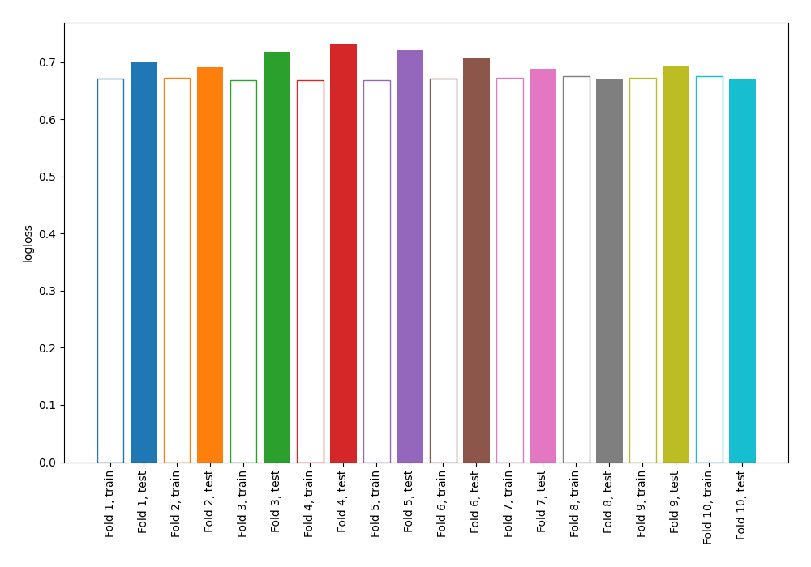

# Summary of 4_Linear

[<< Go back](../README.md)

## Logistic Regression (Linear)
- **n_jobs**: -1
- **explain_level**: 0

## Validation
 - **validation_type**: kfold
 - **shuffle**: True
 - **stratify**: True
 - **k_folds**: 10

## Optimized metric
logloss

## Training time

3.8 seconds

## Metric details
|           |    score |   threshold |
|:----------|---------:|------------:|
| logloss   | 0.699841 |  nan        |
| auc       | 0.538658 |  nan        |
| f1        | 0.677188 |    0.207081 |
| accuracy  | 0.567245 |    0.45539  |
| precision | 0.552975 |    0.45539  |
| recall    | 1        |    0.207081 |
| mcc       | 0.14258  |    0.43078  |

## Confusion matrix (at threshold=0.45539)
|                     |   Predicted as negative |   Predicted as positive |
|:--------------------|------------------------:|------------------------:|
| Labeled as negative |                     142 |                     308 |
| Labeled as positive |                      91 |                     381 |

## Learning curves

[<< Go back](../README.md)
