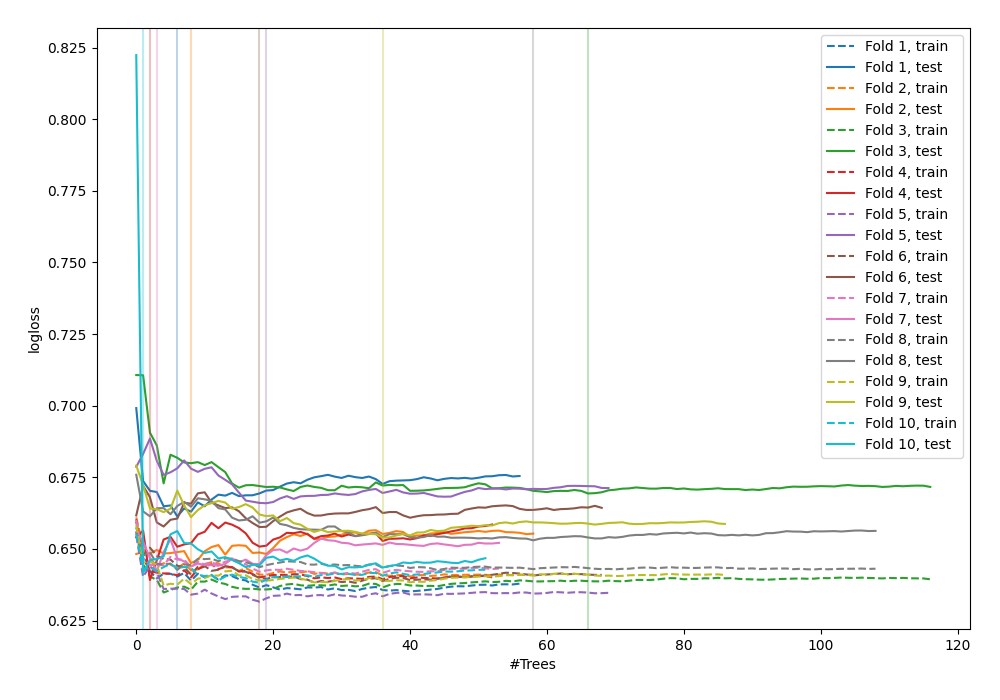

# Summary of 50_ExtraTrees

[<< Go back](../README.md)

## Extra Trees Classifier (Extra Trees)
- **n_jobs**: -1
- **criterion**: gini
- **max_features**: 0.8
- **min_samples_split**: 40
- **max_depth**: 3
- **explain_level**: 0

## Validation
 - **validation_type**: kfold
 - **shuffle**: True
 - **stratify**: True
 - **k_folds**: 10

## Optimized metric
logloss

## Training time

6.0 seconds

## Metric details
|           |    score |   threshold |
|:----------|---------:|------------:|
| logloss   | 0.652922 | nan         |
| auc       | 0.686662 | nan         |
| f1        | 0.706742 |   0.458817  |
| accuracy  | 0.642082 |   0.509102  |
| precision | 1        |   0.795203  |
| recall    | 1        |   0.0917647 |
| mcc       | 0.283314 |   0.509102  |

## Confusion matrix (at threshold=0.509102)
|                     |   Predicted as negative |   Predicted as positive |
|:--------------------|------------------------:|------------------------:|
| Labeled as negative |                     266 |                     184 |
| Labeled as positive |                     146 |                     326 |

## Learning curves

[<< Go back](../README.md)
