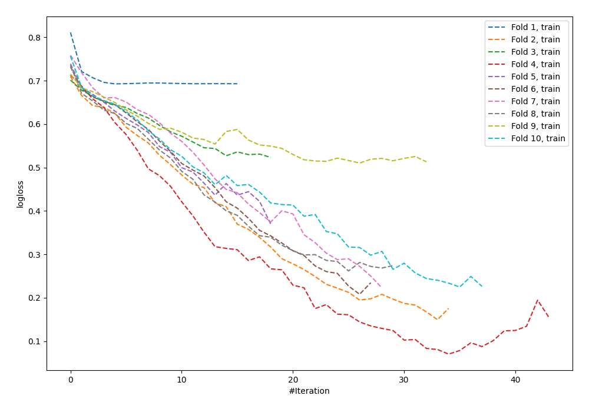

# Summary of 57_NeuralNetwork

[<< Go back](../README.md)

## Neural Network
- **n_jobs**: -1
- **dense_1_size**: 32
- **dense_2_size**: 4
- **learning_rate**: 0.05
- **explain_level**: 0

## Validation
 - **validation_type**: kfold
 - **shuffle**: True
 - **stratify**: True
 - **k_folds**: 10

## Optimized metric
logloss

## Training time

2.5 seconds

## Metric details
|           |    score |     threshold |
|:----------|---------:|--------------:|
| logloss   | 0.894062 | nan           |
| auc       | 0.646441 | nan           |
| f1        | 0.686809 |   0.00683446  |
| accuracy  | 0.611714 |   0.376758    |
| precision | 0.869565 |   0.99996     |
| recall    | 1        |   4.65265e-06 |
| mcc       | 0.225119 |   0.376758    |

## Confusion matrix (at threshold=0.376758)
|                     |   Predicted as negative |   Predicted as positive |
|:--------------------|------------------------:|------------------------:|
| Labeled as negative |                     216 |                     234 |
| Labeled as positive |                     124 |                     348 |

## Learning curves

[<< Go back](../README.md)
