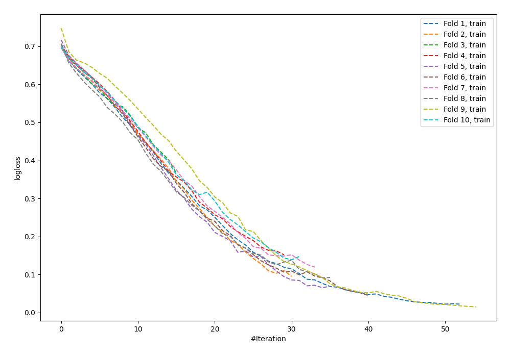

# Summary of 58_NeuralNetwork

[<< Go back](../README.md)

## Neural Network
- **n_jobs**: -1
- **dense_1_size**: 64
- **dense_2_size**: 16
- **learning_rate**: 0.01
- **explain_level**: 0

## Validation
 - **validation_type**: kfold
 - **shuffle**: True
 - **stratify**: True
 - **k_folds**: 10

## Optimized metric
logloss

## Training time

5.2 seconds

## Metric details
|           |    score |     threshold |
|:----------|---------:|--------------:|
| logloss   | 0.765765 | nan           |
| auc       | 0.725847 | nan           |
| f1        | 0.716495 |   0.221651    |
| accuracy  | 0.66269  |   0.38057     |
| precision | 0.911111 |   0.998344    |
| recall    | 1        |   5.60116e-06 |
| mcc       | 0.331895 |   0.38057     |

## Confusion matrix (at threshold=0.38057)
|                     |   Predicted as negative |   Predicted as positive |
|:--------------------|------------------------:|------------------------:|
| Labeled as negative |                     236 |                     214 |
| Labeled as positive |                      97 |                     375 |

## Learning curves

[<< Go back](../README.md)
