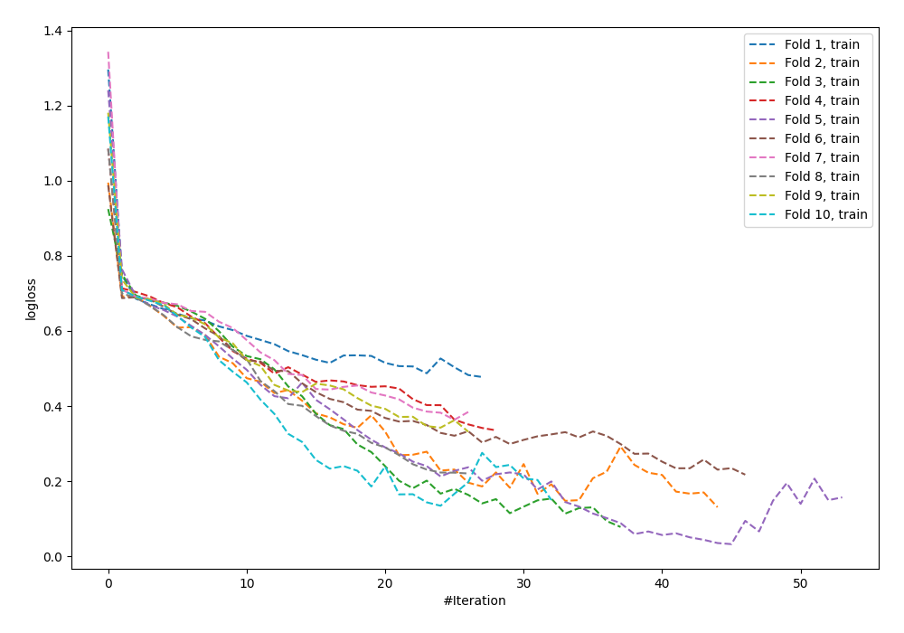

# Summary of 59_NeuralNetwork

[<< Go back](../README.md)

## Neural Network
- **n_jobs**: -1
- **dense_1_size**: 64
- **dense_2_size**: 32
- **learning_rate**: 0.08
- **explain_level**: 0

## Validation
 - **validation_type**: kfold
 - **shuffle**: True
 - **stratify**: True
 - **k_folds**: 10

## Optimized metric
logloss

## Training time

5.1 seconds

## Metric details
|           |    score |     threshold |
|:----------|---------:|--------------:|
| logloss   | 1.09312  | nan           |
| auc       | 0.713686 | nan           |
| f1        | 0.70962  |   0.314087    |
| accuracy  | 0.663774 |   0.448578    |
| precision | 0.90625  |   0.999998    |
| recall    | 1        |   1.14698e-13 |
| mcc       | 0.326805 |   0.448578    |

## Confusion matrix (at threshold=0.448578)
|                     |   Predicted as negative |   Predicted as positive |
|:--------------------|------------------------:|------------------------:|
| Labeled as negative |                     287 |                     163 |
| Labeled as positive |                     147 |                     325 |

## Learning curves

[<< Go back](../README.md)
