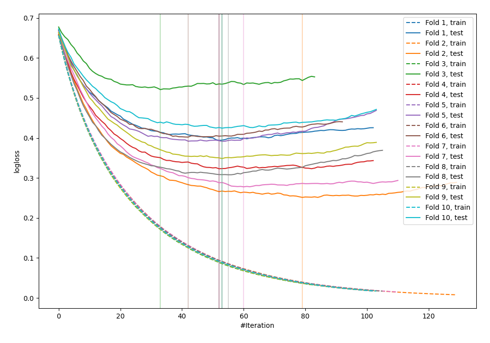

# Summary of 5_Default_LightGBM_Stacked

[<< Go back](../README.md)

## LightGBM
- **n_jobs**: -1
- **objective**: binary
- **metric**: binary_logloss
- **num_leaves**: 63
- **learning_rate**: 0.05
- **feature_fraction**: 0.9
- **bagging_fraction**: 0.9
- **min_data_in_leaf**: 10
- **explain_level**: 0

## Validation
 - **validation_type**: kfold
 - **shuffle**: True
 - **stratify**: True
 - **k_folds**: 10

## Optimized metric
logloss

## Training time

7.5 seconds

## Metric details
|           |    score |    threshold |
|:----------|---------:|-------------:|
| logloss   | 0.364057 | nan          |
| auc       | 0.918974 | nan          |
| f1        | 0.842105 |   0.428275   |
| accuracy  | 0.838395 |   0.659566   |
| precision | 1        |   0.97267    |
| recall    | 1        |   0.00794948 |
| mcc       | 0.688471 |   0.733746   |

## Confusion matrix (at threshold=0.659566)
|                     |   Predicted as negative |   Predicted as positive |
|:--------------------|------------------------:|------------------------:|
| Labeled as negative |                     406 |                      44 |
| Labeled as positive |                     105 |                     367 |

## Learning curves

[<< Go back](../README.md)
