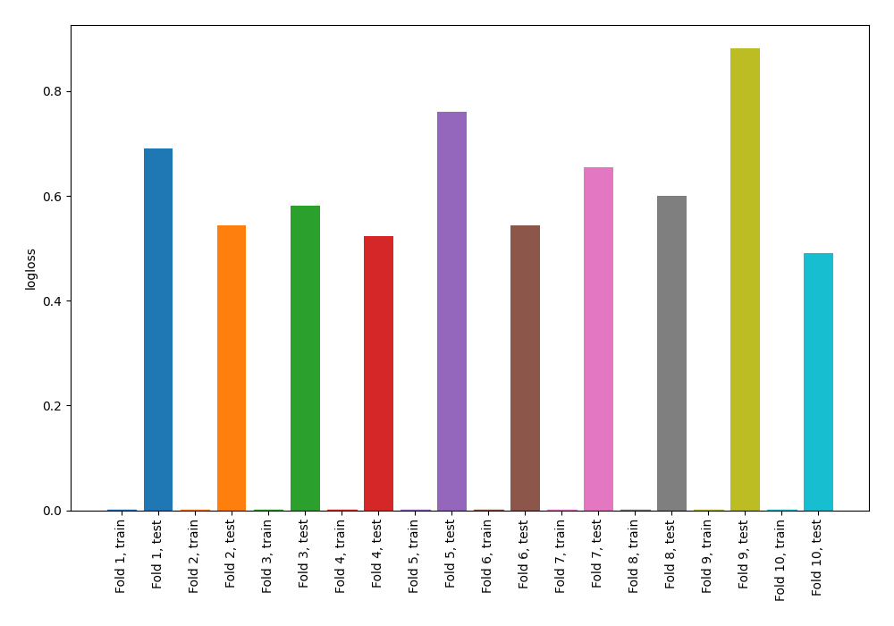

# Summary of 68_NearestNeighbors

[<< Go back](../README.md)

## k-Nearest Neighbors (Nearest Neighbors)
- **n_jobs**: -1
- **n_neighbors**: 7
- **weights**: distance
- **explain_level**: 0

## Validation
 - **validation_type**: kfold
 - **shuffle**: True
 - **stratify**: True
 - **k_folds**: 10

## Optimized metric
logloss

## Training time

1.0 seconds

## Metric details
|           |    score |   threshold |
|:----------|---------:|------------:|
| logloss   | 0.627237 |  nan        |
| auc       | 0.757858 |  nan        |
| f1        | 0.715409 |    0.246136 |
| accuracy  | 0.697397 |    0.457263 |
| precision | 0.9      |    0.944918 |
| recall    | 0.997881 |    0        |
| mcc       | 0.394184 |    0.457263 |

## Confusion matrix (at threshold=0.457263)
|                     |   Predicted as negative |   Predicted as positive |
|:--------------------|------------------------:|------------------------:|
| Labeled as negative |                     302 |                     148 |
| Labeled as positive |                     131 |                     341 |

## Learning curves

[<< Go back](../README.md)
