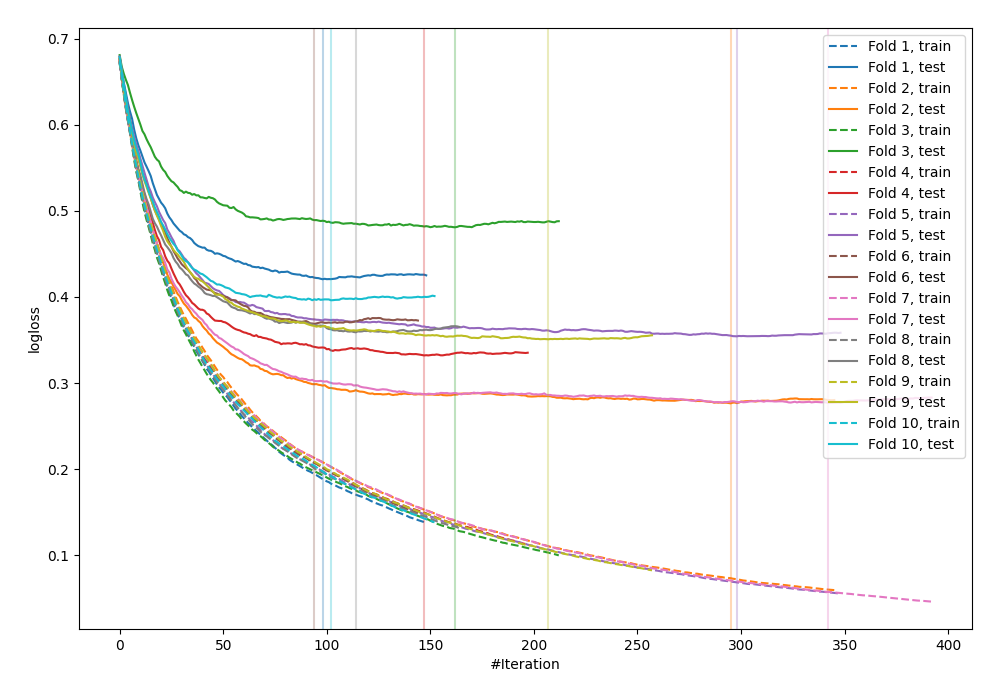

# Summary of 69_CatBoost_Stacked

[<< Go back](../README.md)

## CatBoost
- **n_jobs**: -1
- **learning_rate**: 0.025
- **depth**: 8
- **rsm**: 0.8
- **loss_function**: Logloss
- **explain_level**: 0

## Validation
 - **validation_type**: kfold
 - **shuffle**: True
 - **stratify**: True
 - **k_folds**: 10

## Optimized metric
logloss

## Training time

54.1 seconds

## Metric details
|           |    score |    threshold |
|:----------|---------:|-------------:|
| logloss   | 0.361555 | nan          |
| auc       | 0.920019 | nan          |
| f1        | 0.845596 |   0.463863   |
| accuracy  | 0.847072 |   0.647854   |
| precision | 1        |   0.982905   |
| recall    | 1        |   0.00485774 |
| mcc       | 0.697681 |   0.647854   |

## Confusion matrix (at threshold=0.647854)
|                     |   Predicted as negative |   Predicted as positive |
|:--------------------|------------------------:|------------------------:|
| Labeled as negative |                     401 |                      49 |
| Labeled as positive |                      92 |                     380 |

## Learning curves

[<< Go back](../README.md)
