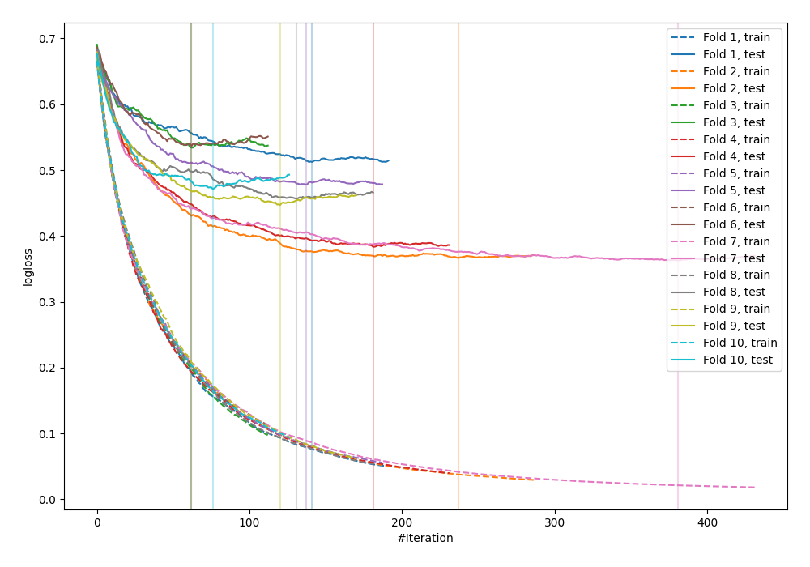

# Summary of 6_Default_Xgboost

[<< Go back](../README.md)

## Extreme Gradient Boosting (Xgboost)
- **n_jobs**: -1
- **objective**: binary:logistic
- **eval_metric**: logloss
- **eta**: 0.075
- **max_depth**: 6
- **min_child_weight**: 1
- **subsample**: 1.0
- **colsample_bytree**: 1.0
- **explain_level**: 0

## Validation
 - **validation_type**: kfold
 - **shuffle**: True
 - **stratify**: True
 - **k_folds**: 10

## Optimized metric
logloss

## Training time

8.5 seconds

## Metric details
|           |    score |   threshold |
|:----------|---------:|------------:|
| logloss   | 0.454812 | nan         |
| auc       | 0.86645  | nan         |
| f1        | 0.804527 |   0.478728  |
| accuracy  | 0.793926 |   0.478728  |
| precision | 0.947368 |   0.966424  |
| recall    | 1        |   0.0014354 |
| mcc       | 0.588109 |   0.478728  |

## Confusion matrix (at threshold=0.478728)
|                     |   Predicted as negative |   Predicted as positive |
|:--------------------|------------------------:|------------------------:|
| Labeled as negative |                     341 |                     109 |
| Labeled as positive |                      81 |                     391 |

## Learning curves

[<< Go back](../README.md)
