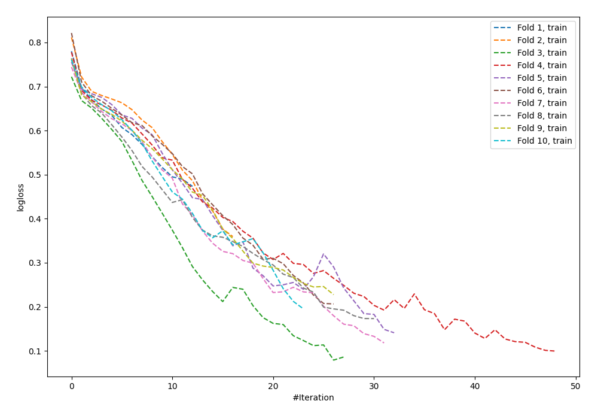

# Summary of 8_Default_NeuralNetwork

[<< Go back](../README.md)

## Neural Network
- **n_jobs**: -1
- **dense_1_size**: 32
- **dense_2_size**: 16
- **learning_rate**: 0.05
- **explain_level**: 0

## Validation
 - **validation_type**: kfold
 - **shuffle**: True
 - **stratify**: True
 - **k_folds**: 10

## Optimized metric
logloss

## Training time

2.8 seconds

## Metric details
|           |    score |     threshold |
|:----------|---------:|--------------:|
| logloss   | 0.920112 | nan           |
| auc       | 0.664214 | nan           |
| f1        | 0.699225 |   0.0581646   |
| accuracy  | 0.613883 |   0.395819    |
| precision | 0.846154 |   0.999883    |
| recall    | 1        |   6.96417e-11 |
| mcc       | 0.232601 |   0.395819    |

## Confusion matrix (at threshold=0.395819)
|                     |   Predicted as negative |   Predicted as positive |
|:--------------------|------------------------:|------------------------:|
| Labeled as negative |                     203 |                     247 |
| Labeled as positive |                     109 |                     363 |

## Learning curves

[<< Go back](../README.md)
