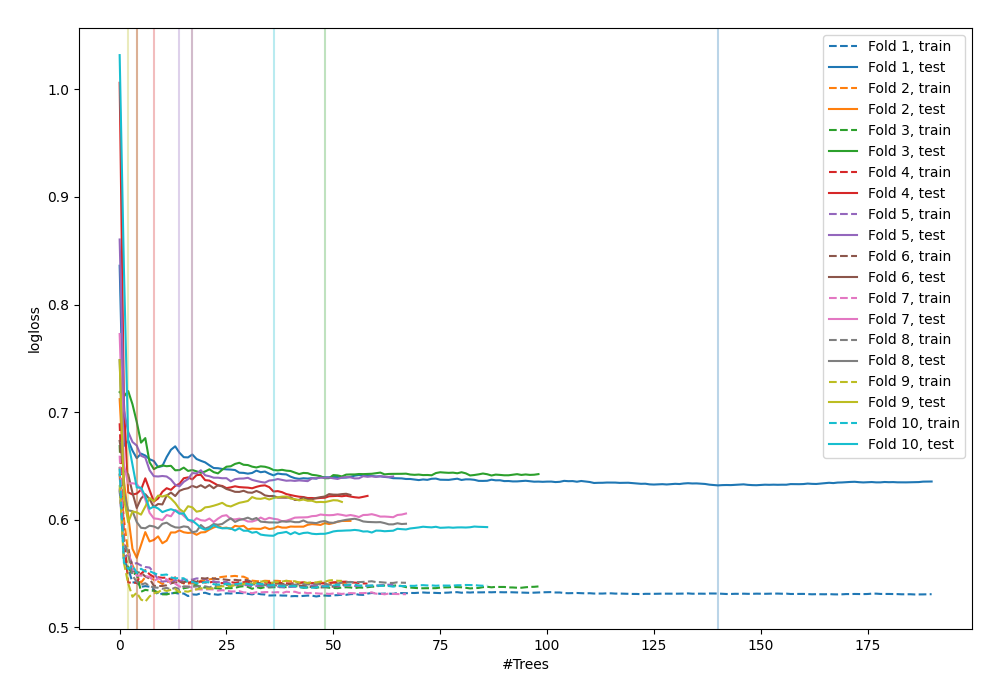

# Summary of 9_Default_RandomForest

[<< Go back](../README.md)

## Random Forest
- **n_jobs**: -1
- **criterion**: gini
- **max_features**: 0.9
- **min_samples_split**: 30
- **max_depth**: 4
- **explain_level**: 0

## Validation
 - **validation_type**: kfold
 - **shuffle**: True
 - **stratify**: True
 - **k_folds**: 10

## Optimized metric
logloss

## Training time

9.2 seconds

## Metric details
|           |    score |   threshold |
|:----------|---------:|------------:|
| logloss   | 0.606296 |  nan        |
| auc       | 0.753225 |  nan        |
| f1        | 0.722719 |    0.431897 |
| accuracy  | 0.690889 |    0.524045 |
| precision | 0.888889 |    0.80002  |
| recall    | 1        |    0.108037 |
| mcc       | 0.38705  |    0.524045 |

## Confusion matrix (at threshold=0.524045)
|                     |   Predicted as negative |   Predicted as positive |
|:--------------------|------------------------:|------------------------:|
| Labeled as negative |                     339 |                     111 |
| Labeled as positive |                     174 |                     298 |

## Learning curves

[<< Go back](../README.md)
