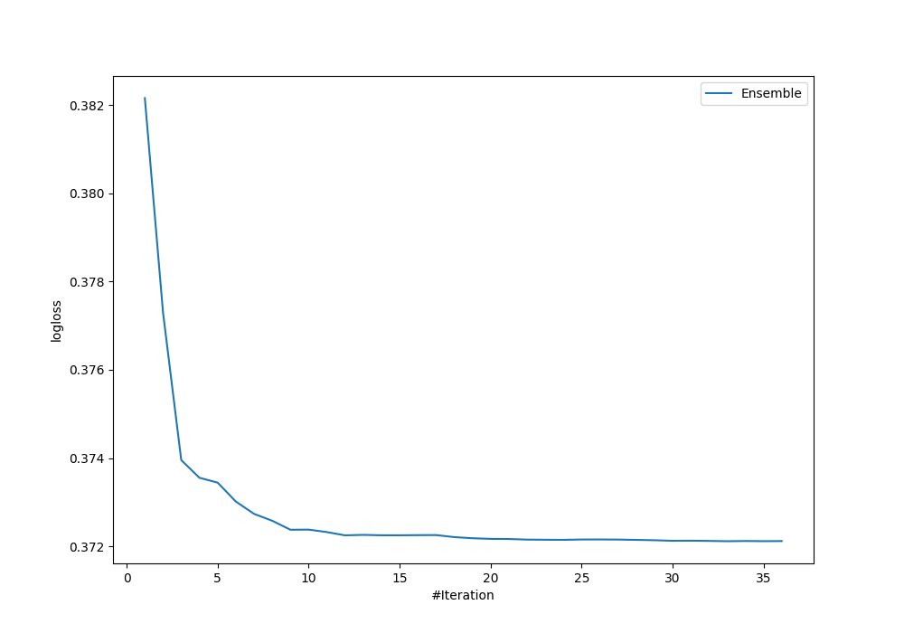

# Summary of Ensemble

[<< Go back](../README.md)

## Ensemble structure
| Model       |   Weight |
|:------------|---------:|
| 22_LightGBM |        3 |
| 30_CatBoost |        6 |
| 31_CatBoost |       11 |
| 32_CatBoost |       12 |
| 69_CatBoost |        1 |

## Metric details
|           |    score |    threshold |
|:----------|---------:|-------------:|
| logloss   | 0.372117 | nan          |
| auc       | 0.91459  | nan          |
| f1        | 0.849794 |   0.467637   |
| accuracy  | 0.841649 |   0.467637   |
| precision | 1        |   0.99352    |
| recall    | 1        |   0.00246705 |
| mcc       | 0.684437 |   0.554517   |

## Confusion matrix (at threshold=0.467637)
|                     |   Predicted as negative |   Predicted as positive |
|:--------------------|------------------------:|------------------------:|
| Labeled as negative |                     363 |                      87 |
| Labeled as positive |                      59 |                     413 |

## Learning curves

[<< Go back](../README.md)
