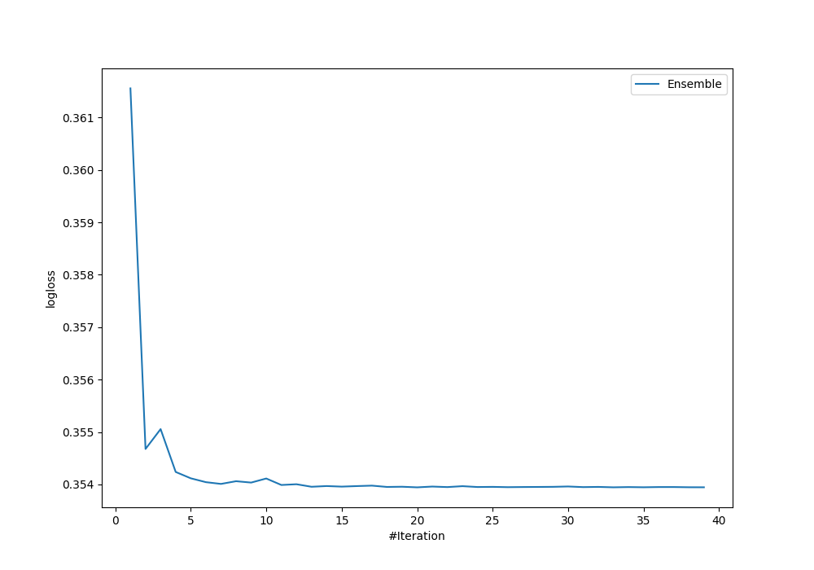

# Summary of Ensemble_Stacked

[<< Go back](../README.md)

## Ensemble structure
| Model                      |   Weight |
|:---------------------------|---------:|
| 32_CatBoost                |        1 |
| 5_Default_LightGBM_Stacked |        9 |
| 69_CatBoost_Stacked        |        8 |
| Ensemble                   |        2 |

## Metric details
|           |    score |   threshold |
|:----------|---------:|------------:|
| logloss   | 0.353944 | nan         |
| auc       | 0.923983 | nan         |
| f1        | 0.845133 |   0.619436  |
| accuracy  | 0.848156 |   0.619436  |
| precision | 1        |   0.974862  |
| recall    | 1        |   0.0072861 |
| mcc       | 0.699397 |   0.619436  |

## Confusion matrix (at threshold=0.619436)
|                     |   Predicted as negative |   Predicted as positive |
|:--------------------|------------------------:|------------------------:|
| Labeled as negative |                     400 |                      50 |
| Labeled as positive |                      90 |                     382 |

## Learning curves

[<< Go back](../README.md)
