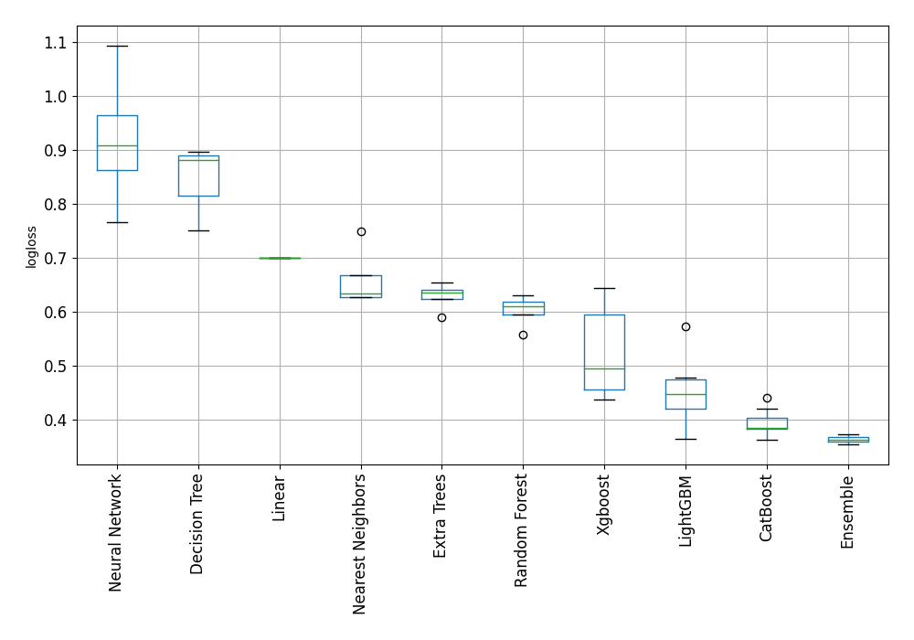

# AutoML Leaderboard

| Best model   | name                                                                 | model_type        | metric_type   |   metric_value |   train_time |
|:-------------|:---------------------------------------------------------------------|:------------------|:--------------|---------------:|-------------:|
|              | [1_DecisionTree](1_DecisionTree/README.md)                           | Decision Tree     | logloss       |       0.74979  |         1.46 |
|              | [2_DecisionTree](2_DecisionTree/README.md)                           | Decision Tree     | logloss       |       0.895981 |         1.21 |
|              | [3_DecisionTree](3_DecisionTree/README.md)                           | Decision Tree     | logloss       |       0.880997 |         1.24 |
|              | [4_Linear](4_Linear/README.md)                                       | Linear            | logloss       |       0.699841 |         4.04 |
|              | [5_Default_LightGBM](5_Default_LightGBM/README.md)                   | LightGBM          | logloss       |       0.417879 |         6.26 |
|              | [6_Default_Xgboost](6_Default_Xgboost/README.md)                     | Xgboost           | logloss       |       0.454812 |         8.94 |
|              | [7_Default_CatBoost](7_Default_CatBoost/README.md)                   | CatBoost          | logloss       |       0.41995  |        14.85 |
|              | [8_Default_NeuralNetwork](8_Default_NeuralNetwork/README.md)         | Neural Network    | logloss       |       0.920112 |         3.17 |
|              | [9_Default_RandomForest](9_Default_RandomForest/README.md)           | Random Forest     | logloss       |       0.606296 |         9.55 |
|              | [10_Default_ExtraTrees](10_Default_ExtraTrees/README.md)             | Extra Trees       | logloss       |       0.635354 |         8.35 |
|              | [11_Default_NearestNeighbors](11_Default_NearestNeighbors/README.md) | Nearest Neighbors | logloss       |       0.748981 |         1.37 |
|              | [21_LightGBM](21_LightGBM/README.md)                                 | LightGBM          | logloss       |       0.46641  |         3.48 |
|              | [12_Xgboost](12_Xgboost/README.md)                                   | Xgboost           | logloss       |       0.494823 |         9.6  |
| **the best** | [30_CatBoost](30_CatBoost/README.md)                                 | CatBoost          | logloss       |       0.38322  |        49.43 |
|              | [39_RandomForest](39_RandomForest/README.md)                         | Random Forest     | logloss       |       0.613441 |         9.14 |
|              | [48_ExtraTrees](48_ExtraTrees/README.md)                             | Extra Trees       | logloss       |       0.635053 |         5.56 |
|              | [57_NeuralNetwork](57_NeuralNetwork/README.md)                       | Neural Network    | logloss       |       0.894062 |         2.78 |
|              | [66_NearestNeighbors](66_NearestNeighbors/README.md)                 | Nearest Neighbors | logloss       |       0.640914 |         1.28 |
|              | [22_LightGBM](22_LightGBM/README.md)                                 | LightGBM          | logloss       |       0.42689  |         3.17 |
|              | [13_Xgboost](13_Xgboost/README.md)                                   | Xgboost           | logloss       |       0.437473 |         8.17 |
|              | [31_CatBoost](31_CatBoost/README.md)                                 | CatBoost          | logloss       |       0.383655 |        41.14 |
|              | [40_RandomForest](40_RandomForest/README.md)                         | Random Forest     | logloss       |       0.557022 |         9.82 |
|              | [49_ExtraTrees](49_ExtraTrees/README.md)                             | Extra Trees       | logloss       |       0.588474 |         6.35 |
|              | [58_NeuralNetwork](58_NeuralNetwork/README.md)                       | Neural Network    | logloss       |       0.765765 |         5.49 |
|              | [67_NearestNeighbors](67_NearestNeighbors/README.md)                 | Nearest Neighbors | logloss       |       0.627237 |         1.27 |
|              | [23_LightGBM](23_LightGBM/README.md)                                 | LightGBM          | logloss       |       0.476956 |         2.75 |
|              | [14_Xgboost](14_Xgboost/README.md)                                   | Xgboost           | logloss       |       0.594925 |         3.29 |
|              | [32_CatBoost](32_CatBoost/README.md)                                 | CatBoost          | logloss       |       0.385259 |        25.03 |
|              | [41_RandomForest](41_RandomForest/README.md)                         | Random Forest     | logloss       |       0.629578 |         7.72 |
|              | [50_ExtraTrees](50_ExtraTrees/README.md)                             | Extra Trees       | logloss       |       0.652922 |         6.48 |
|              | [59_NeuralNetwork](59_NeuralNetwork/README.md)                       | Neural Network    | logloss       |       1.09312  |         5.37 |
|              | [68_NearestNeighbors](68_NearestNeighbors/README.md)                 | Nearest Neighbors | logloss       |       0.627237 |         1.28 |
|              | [24_LightGBM](24_LightGBM/README.md)                                 | LightGBM          | logloss       |       0.571743 |         3.76 |
|              | [15_Xgboost](15_Xgboost/README.md)                                   | Xgboost           | logloss       |       0.643865 |        43.59 |

### AutoML Performance

### AutoML Performance Boxplot
