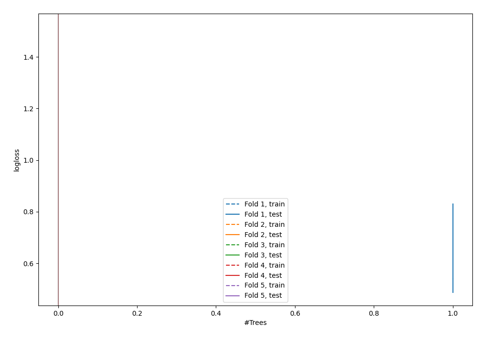

# Summary of 1_DecisionTree

[<< Go back](../README.md)

## Decision Tree
- **n_jobs**: -1
- **criterion**: gini
- **max_depth**: 3
- **explain_level**: 0

## Validation
 - **validation_type**: kfold
 - **shuffle**: True
 - **stratify**: True
 - **k_folds**: 5

## Optimized metric
logloss

## Training time

0.9 seconds

## Metric details
|           |    score |   threshold |
|:----------|---------:|------------:|
| logloss   | 1.13475  |  nan        |
| auc       | 0.570252 |  nan        |
| f1        | 0.656168 |    0.180851 |
| accuracy  | 0.58147  |    0.180851 |
| precision | 0.518672 |    0.180851 |
| recall    | 0.942857 |    0        |
| mcc       | 0.262678 |    0.180851 |

## Confusion matrix (at threshold=0.180851)
|                     |   Predicted as negative |   Predicted as positive |
|:--------------------|------------------------:|------------------------:|
| Labeled as negative |                      57 |                     116 |
| Labeled as positive |                      15 |                     125 |

## Learning curves

[<< Go back](../README.md)
