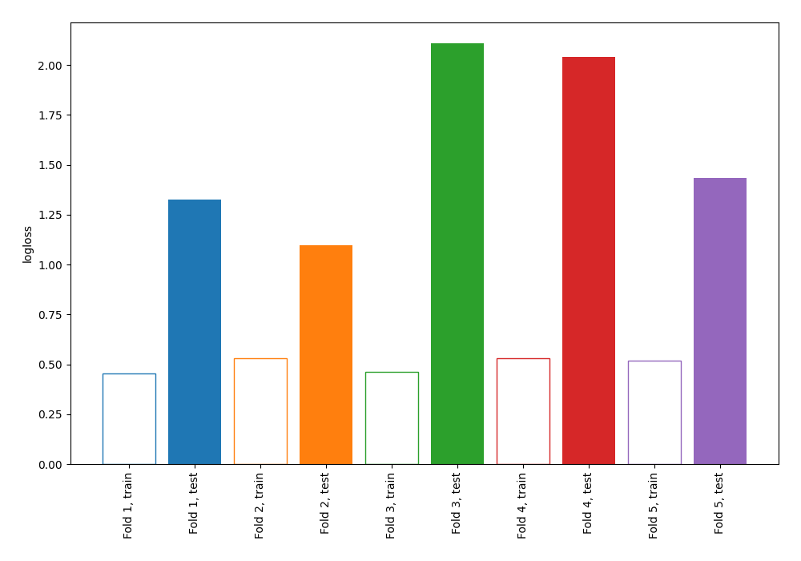

# Summary of 100_DecisionTree

[<< Go back](../README.md)

## Decision Tree
- **n_jobs**: -1
- **criterion**: entropy
- **max_depth**: 4
- **explain_level**: 0

## Validation
 - **validation_type**: kfold
 - **shuffle**: True
 - **stratify**: True
 - **k_folds**: 5

## Optimized metric
logloss

## Training time

0.7 seconds

## Metric details
|           |     score |   threshold |
|:----------|----------:|------------:|
| logloss   | 1.60097   |  nan        |
| auc       | 0.528157  |  nan        |
| f1        | 0.650919  |    0        |
| accuracy  | 0.538182  |    0.590852 |
| precision | 0.529915  |    0.590852 |
| recall    | 0.925373  |    0        |
| mcc       | 0.0876553 |    0.14     |

## Confusion matrix (at threshold=0.590852)
|                     |   Predicted as negative |   Predicted as positive |
|:--------------------|------------------------:|------------------------:|
| Labeled as negative |                      86 |                      55 |
| Labeled as positive |                      72 |                      62 |

## Learning curves

[<< Go back](../README.md)
