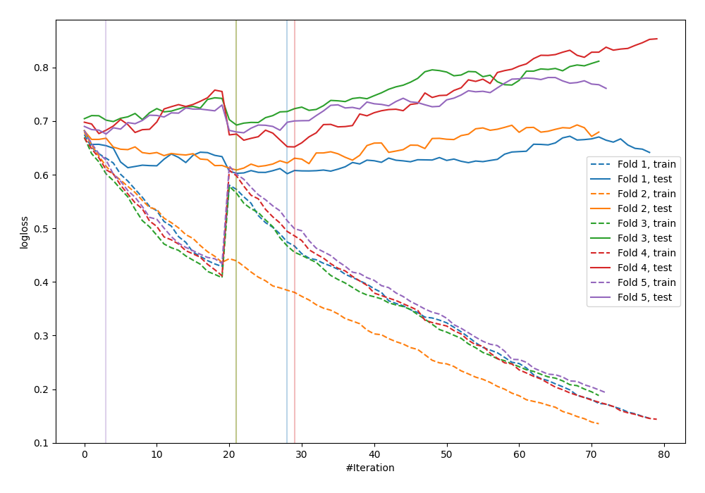

# Summary of 102_CatBoost

[<< Go back](../README.md)

## CatBoost
- **n_jobs**: -1
- **learning_rate**: 0.2
- **depth**: 4
- **rsm**: 0.7
- **loss_function**: Logloss
- **explain_level**: 0

## Validation
 - **validation_type**: kfold
 - **shuffle**: True
 - **stratify**: True
 - **k_folds**: 5

## Optimized metric
logloss

## Training time

5.6 seconds

## Metric details
|           |    score |   threshold |
|:----------|---------:|------------:|
| logloss   | 0.646707 |  nan        |
| auc       | 0.656796 |  nan        |
| f1        | 0.671795 |    0.286082 |
| accuracy  | 0.625455 |    0.518953 |
| precision | 1        |    0.750351 |
| recall    | 1        |    0.124264 |
| mcc       | 0.273769 |    0.6751   |

## Confusion matrix (at threshold=0.518953)
|                     |   Predicted as negative |   Predicted as positive |
|:--------------------|------------------------:|------------------------:|
| Labeled as negative |                      98 |                      43 |
| Labeled as positive |                      60 |                      74 |

## Learning curves

[<< Go back](../README.md)
