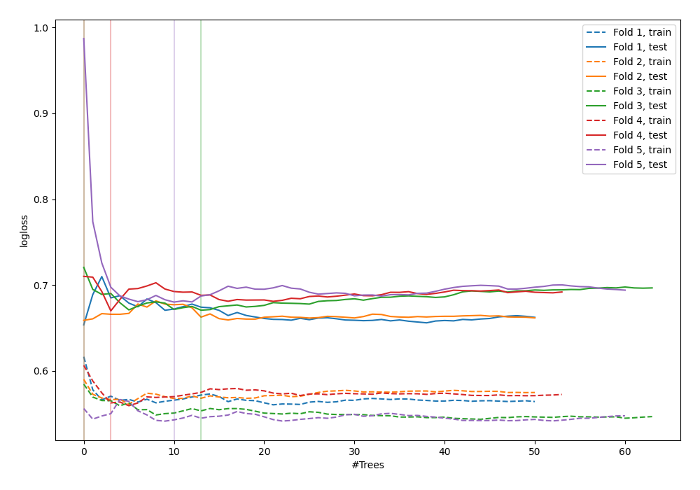

# Summary of 10_Default_ExtraTrees

[<< Go back](../README.md)

## Extra Trees Classifier (Extra Trees)
- **n_jobs**: -1
- **criterion**: gini
- **max_features**: 0.9
- **min_samples_split**: 30
- **max_depth**: 4
- **explain_level**: 0

## Validation
 - **validation_type**: kfold
 - **shuffle**: True
 - **stratify**: True
 - **k_folds**: 5

## Optimized metric
logloss

## Training time

2.5 seconds

## Metric details
|           |    score |   threshold |
|:----------|---------:|------------:|
| logloss   | 0.666682 |  nan        |
| auc       | 0.63282  |  nan        |
| f1        | 0.671875 |    0.282591 |
| accuracy  | 0.618182 |    0.473152 |
| precision | 0.72973  |    0.679952 |
| recall    | 1        |    0        |
| mcc       | 0.238184 |    0.473152 |

## Confusion matrix (at threshold=0.473152)
|                     |   Predicted as negative |   Predicted as positive |
|:--------------------|------------------------:|------------------------:|
| Labeled as negative |                      83 |                      58 |
| Labeled as positive |                      47 |                      87 |

## Learning curves

[<< Go back](../README.md)
