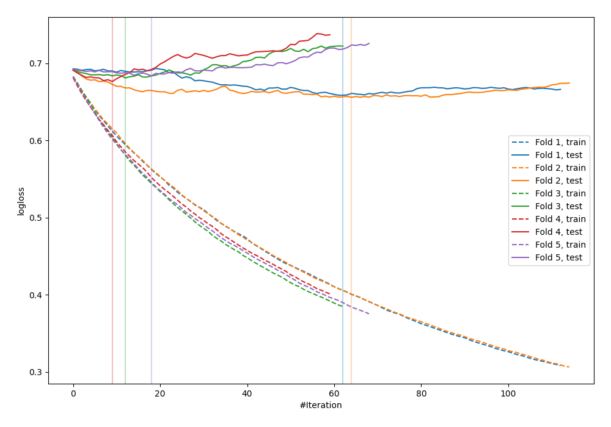

# Summary of 12_Xgboost

[<< Go back](../README.md)

## Extreme Gradient Boosting (Xgboost)
- **n_jobs**: -1
- **objective**: binary:logistic
- **eval_metric**: logloss
- **eta**: 0.05
- **max_depth**: 8
- **min_child_weight**: 5
- **subsample**: 1.0
- **colsample_bytree**: 1.0
- **explain_level**: 0

## Validation
 - **validation_type**: kfold
 - **shuffle**: True
 - **stratify**: True
 - **k_folds**: 5

## Optimized metric
logloss

## Training time

1.1 seconds

## Metric details
|           |    score |   threshold |
|:----------|---------:|------------:|
| logloss   | 0.671053 |  nan        |
| auc       | 0.617233 |  nan        |
| f1        | 0.662757 |    0.39826  |
| accuracy  | 0.6      |    0.508592 |
| precision | 1        |    0.77117  |
| recall    | 1        |    0.158953 |
| mcc       | 0.204623 |    0.39826  |

## Confusion matrix (at threshold=0.508592)
|                     |   Predicted as negative |   Predicted as positive |
|:--------------------|------------------------:|------------------------:|
| Labeled as negative |                      96 |                      45 |
| Labeled as positive |                      65 |                      69 |

## Learning curves

[<< Go back](../README.md)
