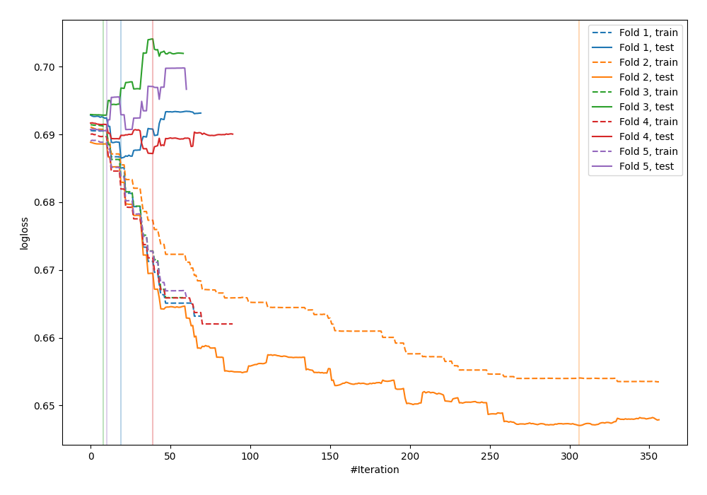

# Summary of 14_Xgboost

[<< Go back](../README.md)

## Extreme Gradient Boosting (Xgboost)
- **n_jobs**: -1
- **objective**: binary:logistic
- **eval_metric**: logloss
- **eta**: 0.1
- **max_depth**: 7
- **min_child_weight**: 25
- **subsample**: 0.9
- **colsample_bytree**: 0.6
- **explain_level**: 0

## Validation
 - **validation_type**: kfold
 - **shuffle**: True
 - **stratify**: True
 - **k_folds**: 5

## Optimized metric
logloss

## Training time

0.9 seconds

## Metric details
|           |    score |   threshold |
|:----------|---------:|------------:|
| logloss   | 0.680822 |  nan        |
| auc       | 0.614957 |  nan        |
| f1        | 0.658477 |    0.369474 |
| accuracy  | 0.596364 |    0.498549 |
| precision | 0.731707 |    0.512609 |
| recall    | 1        |    0.28748  |
| mcc       | 0.2047   |    0.512609 |

## Confusion matrix (at threshold=0.498549)
|                     |   Predicted as negative |   Predicted as positive |
|:--------------------|------------------------:|------------------------:|
| Labeled as negative |                     106 |                      35 |
| Labeled as positive |                      76 |                      58 |

## Learning curves

[<< Go back](../README.md)
