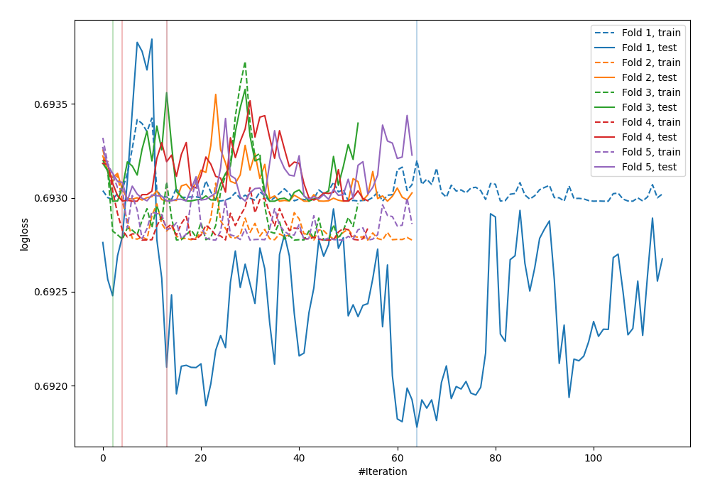

# Summary of 17_Xgboost

[<< Go back](../README.md)

## Extreme Gradient Boosting (Xgboost)
- **n_jobs**: -1
- **objective**: binary:logistic
- **eval_metric**: logloss
- **eta**: 0.15
- **max_depth**: 4
- **min_child_weight**: 25
- **subsample**: 0.7
- **colsample_bytree**: 0.7
- **explain_level**: 0

## Validation
 - **validation_type**: kfold
 - **shuffle**: True
 - **stratify**: True
 - **k_folds**: 5

## Optimized metric
logloss

## Training time

0.3 seconds

## Metric details
|           |      score |   threshold |
|:----------|-----------:|------------:|
| logloss   | 0.692742   |  nan        |
| auc       | 0.505822   |  nan        |
| f1        | 0.655257   |    0.432443 |
| accuracy  | 0.509091   |    0.491468 |
| precision | 0.490909   |    0.491468 |
| recall    | 1          |    0.432443 |
| mcc       | 0.00891012 |    0.491246 |

## Confusion matrix (at threshold=0.491468)
|                     |   Predicted as negative |   Predicted as positive |
|:--------------------|------------------------:|------------------------:|
| Labeled as negative |                     113 |                      28 |
| Labeled as positive |                     107 |                      27 |

## Learning curves

[<< Go back](../README.md)
