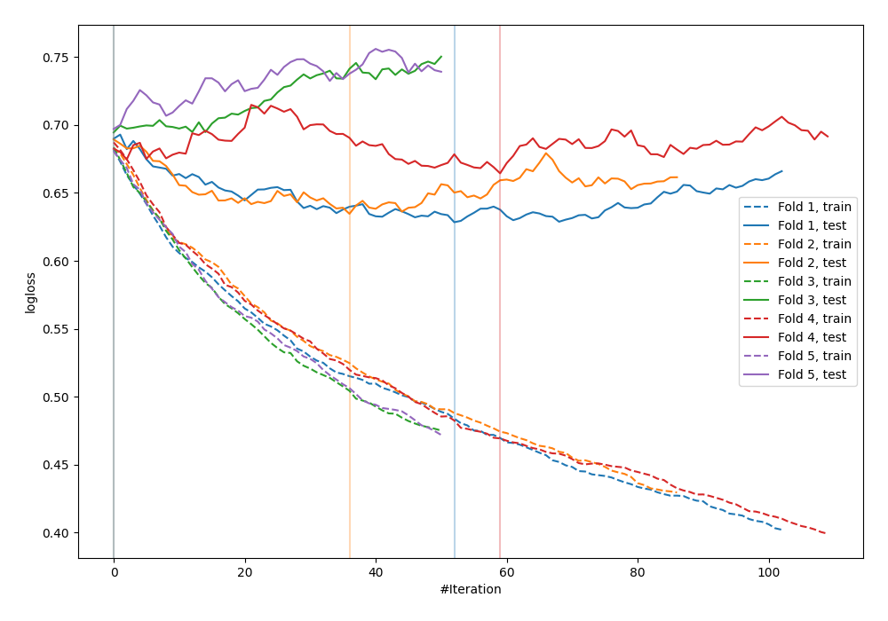

# Summary of 18_Xgboost

[<< Go back](../README.md)

## Extreme Gradient Boosting (Xgboost)
- **n_jobs**: -1
- **objective**: binary:logistic
- **eval_metric**: logloss
- **eta**: 0.1
- **max_depth**: 6
- **min_child_weight**: 5
- **subsample**: 0.5
- **colsample_bytree**: 0.8
- **explain_level**: 0

## Validation
 - **validation_type**: kfold
 - **shuffle**: True
 - **stratify**: True
 - **k_folds**: 5

## Optimized metric
logloss

## Training time

0.9 seconds

## Metric details
|           |    score |   threshold |
|:----------|---------:|------------:|
| logloss   | 0.663813 |  nan        |
| auc       | 0.624907 |  nan        |
| f1        | 0.662983 |    0.341461 |
| accuracy  | 0.596364 |    0.519621 |
| precision | 0.8      |    0.776379 |
| recall    | 1        |    0.123711 |
| mcc       | 0.2047   |    0.60605  |

## Confusion matrix (at threshold=0.519621)
|                     |   Predicted as negative |   Predicted as positive |
|:--------------------|------------------------:|------------------------:|
| Labeled as negative |                     109 |                      32 |
| Labeled as positive |                      79 |                      55 |

## Learning curves

[<< Go back](../README.md)
