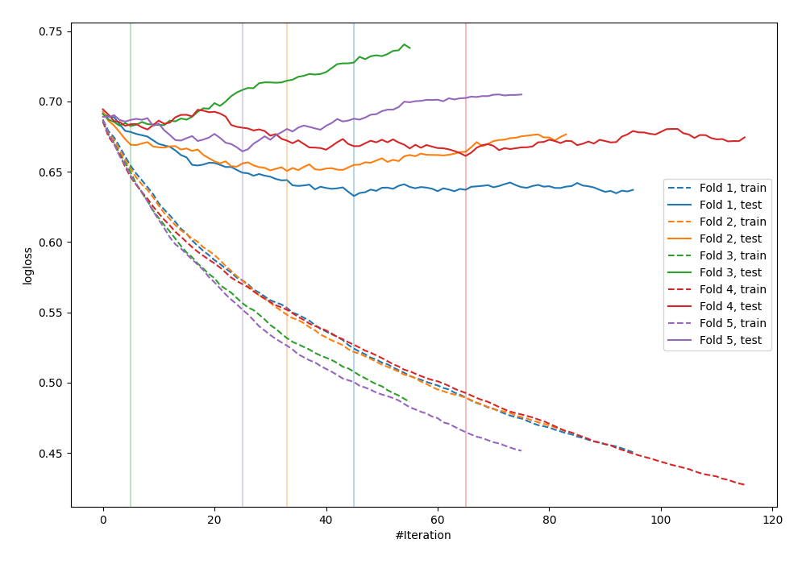

# Summary of 19_Xgboost

[<< Go back](../README.md)

## Extreme Gradient Boosting (Xgboost)
- **n_jobs**: -1
- **objective**: binary:logistic
- **eval_metric**: logloss
- **eta**: 0.075
- **max_depth**: 8
- **min_child_weight**: 10
- **subsample**: 1.0
- **colsample_bytree**: 0.7
- **explain_level**: 0

## Validation
 - **validation_type**: kfold
 - **shuffle**: True
 - **stratify**: True
 - **k_folds**: 5

## Optimized metric
logloss

## Training time

0.9 seconds

## Metric details
|           |    score |   threshold |
|:----------|---------:|------------:|
| logloss   | 0.65833  |  nan        |
| auc       | 0.636975 |  nan        |
| f1        | 0.674221 |    0.388243 |
| accuracy  | 0.6      |    0.45184  |
| precision | 0.833333 |    0.721631 |
| recall    | 1        |    0.174237 |
| mcc       | 0.222538 |    0.605677 |

## Confusion matrix (at threshold=0.45184)
|                     |   Predicted as negative |   Predicted as positive |
|:--------------------|------------------------:|------------------------:|
| Labeled as negative |                      70 |                      71 |
| Labeled as positive |                      39 |                      95 |

## Learning curves

[<< Go back](../README.md)
