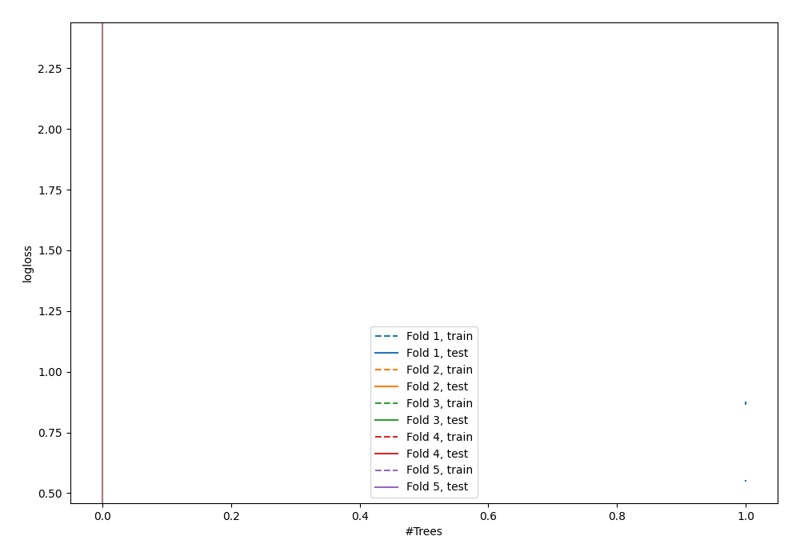

# Summary of 1_DecisionTree

[<< Go back](../README.md)

## Decision Tree
- **n_jobs**: -1
- **criterion**: gini
- **max_depth**: 3
- **explain_level**: 0

## Validation
 - **validation_type**: kfold
 - **shuffle**: True
 - **stratify**: True
 - **k_folds**: 5

## Optimized metric
logloss

## Training time

0.7 seconds

## Metric details
|           |    score |   threshold |
|:----------|---------:|------------:|
| logloss   | 1.2431   |  nan        |
| auc       | 0.550545 |  nan        |
| f1        | 0.653165 |    0        |
| accuracy  | 0.552727 |    0.416958 |
| precision | 0.546667 |    0.719444 |
| recall    | 0.962687 |    0        |
| mcc       | 0.115163 |    0.416958 |

## Confusion matrix (at threshold=0.416958)
|                     |   Predicted as negative |   Predicted as positive |
|:--------------------|------------------------:|------------------------:|
| Labeled as negative |                      61 |                      80 |
| Labeled as positive |                      43 |                      91 |

## Learning curves

[<< Go back](../README.md)
