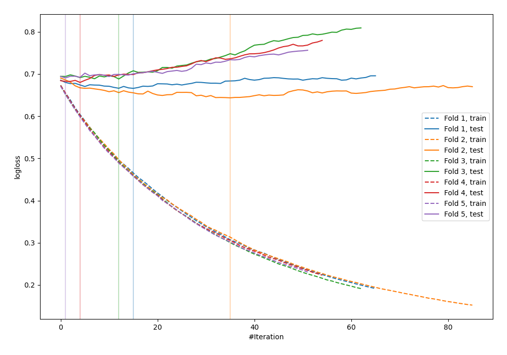

# Summary of 20_Xgboost

[<< Go back](../README.md)

## Extreme Gradient Boosting (Xgboost)
- **n_jobs**: -1
- **objective**: binary:logistic
- **eval_metric**: logloss
- **eta**: 0.05
- **max_depth**: 7
- **min_child_weight**: 1
- **subsample**: 0.9
- **colsample_bytree**: 0.9
- **explain_level**: 0

## Validation
 - **validation_type**: kfold
 - **shuffle**: True
 - **stratify**: True
 - **k_folds**: 5

## Optimized metric
logloss

## Training time

1.8 seconds

## Metric details
|           |    score |   threshold |
|:----------|---------:|------------:|
| logloss   | 0.673569 |  nan        |
| auc       | 0.615777 |  nan        |
| f1        | 0.661247 |    0.412005 |
| accuracy  | 0.6      |    0.523311 |
| precision | 0.833333 |    0.713021 |
| recall    | 1        |    0.183247 |
| mcc       | 0.204617 |    0.523311 |

## Confusion matrix (at threshold=0.523311)
|                     |   Predicted as negative |   Predicted as positive |
|:--------------------|------------------------:|------------------------:|
| Labeled as negative |                     109 |                      32 |
| Labeled as positive |                      78 |                      56 |

## Learning curves

[<< Go back](../README.md)
