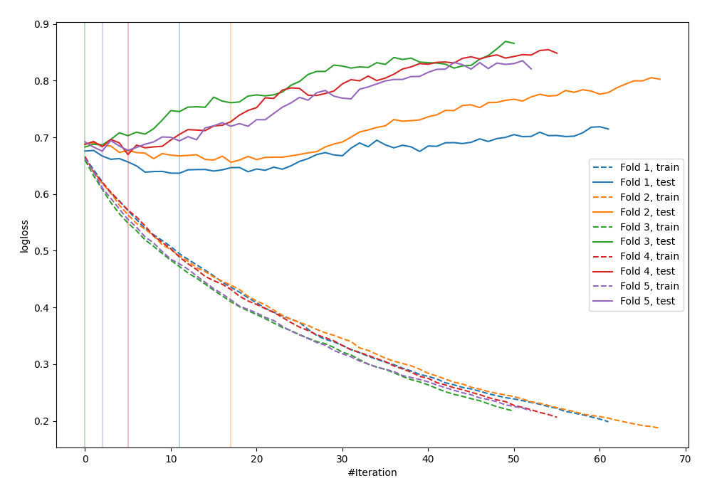

# Summary of 23_LightGBM

[<< Go back](../README.md)

## LightGBM
- **n_jobs**: -1
- **objective**: binary
- **metric**: binary_logloss
- **num_leaves**: 95
- **learning_rate**: 0.2
- **feature_fraction**: 0.9
- **bagging_fraction**: 1.0
- **min_data_in_leaf**: 30
- **explain_level**: 0

## Validation
 - **validation_type**: kfold
 - **shuffle**: True
 - **stratify**: True
 - **k_folds**: 5

## Optimized metric
logloss

## Training time

0.7 seconds

## Metric details
|           |    score |   threshold |
|:----------|---------:|------------:|
| logloss   | 0.664155 |  nan        |
| auc       | 0.640997 |  nan        |
| f1        | 0.66129  |    0.34802  |
| accuracy  | 0.629091 |    0.487449 |
| precision | 0.8      |    0.704943 |
| recall    | 1        |    0.126124 |
| mcc       | 0.258019 |    0.496323 |

## Confusion matrix (at threshold=0.487449)
|                     |   Predicted as negative |   Predicted as positive |
|:--------------------|------------------------:|------------------------:|
| Labeled as negative |                      99 |                      42 |
| Labeled as positive |                      60 |                      74 |

## Learning curves

[<< Go back](../README.md)
