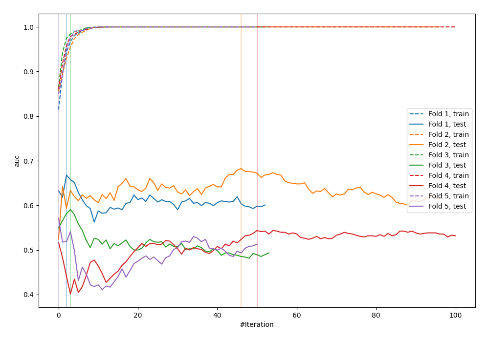

# Summary of 24_LightGBM

[<< Go back](../README.md)

## LightGBM
- **n_jobs**: -1
- **objective**: binary
- **metric**: auc
- **num_leaves**: 31
- **learning_rate**: 0.2
- **feature_fraction**: 0.5
- **bagging_fraction**: 0.8
- **min_data_in_leaf**: 10
- **explain_level**: 0

## Validation
 - **validation_type**: kfold
 - **shuffle**: True
 - **stratify**: True
 - **k_folds**: 5

## Optimized metric
logloss

## Training time

0.8 seconds

## Metric details
|           |    score |    threshold |
|:----------|---------:|-------------:|
| logloss   | 0.827197 | nan          |
| auc       | 0.608235 | nan          |
| f1        | 0.655257 |   0.00130471 |
| accuracy  | 0.610909 |   0.476236   |
| precision | 0.633333 |   0.790849   |
| recall    | 1        |   0.00130471 |
| mcc       | 0.223087 |   0.476236   |

## Confusion matrix (at threshold=0.476236)
|                     |   Predicted as negative |   Predicted as positive |
|:--------------------|------------------------:|------------------------:|
| Labeled as negative |                      83 |                      58 |
| Labeled as positive |                      49 |                      85 |

## Learning curves

[<< Go back](../README.md)
