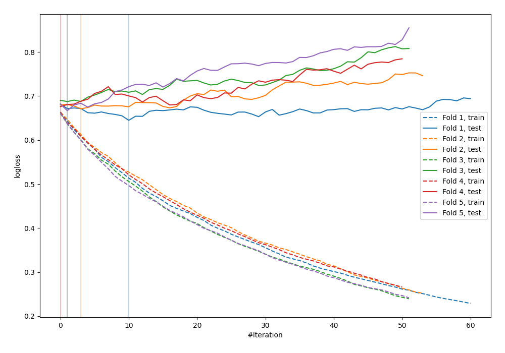

# Summary of 25_LightGBM

[<< Go back](../README.md)

## LightGBM
- **n_jobs**: -1
- **objective**: binary
- **metric**: binary_logloss
- **num_leaves**: 63
- **learning_rate**: 0.2
- **feature_fraction**: 0.5
- **bagging_fraction**: 1.0
- **min_data_in_leaf**: 30
- **explain_level**: 0

## Validation
 - **validation_type**: kfold
 - **shuffle**: True
 - **stratify**: True
 - **k_folds**: 5

## Optimized metric
logloss

## Training time

0.7 seconds

## Metric details
|           |    score |   threshold |
|:----------|---------:|------------:|
| logloss   | 0.669335 |  nan        |
| auc       | 0.628321 |  nan        |
| f1        | 0.663342 |    0.307226 |
| accuracy  | 0.621818 |    0.485235 |
| precision | 0.75     |    0.624579 |
| recall    | 1        |    0.205824 |
| mcc       | 0.245759 |    0.485235 |

## Confusion matrix (at threshold=0.485235)
|                     |   Predicted as negative |   Predicted as positive |
|:--------------------|------------------------:|------------------------:|
| Labeled as negative |                      83 |                      58 |
| Labeled as positive |                      46 |                      88 |

## Learning curves

[<< Go back](../README.md)
