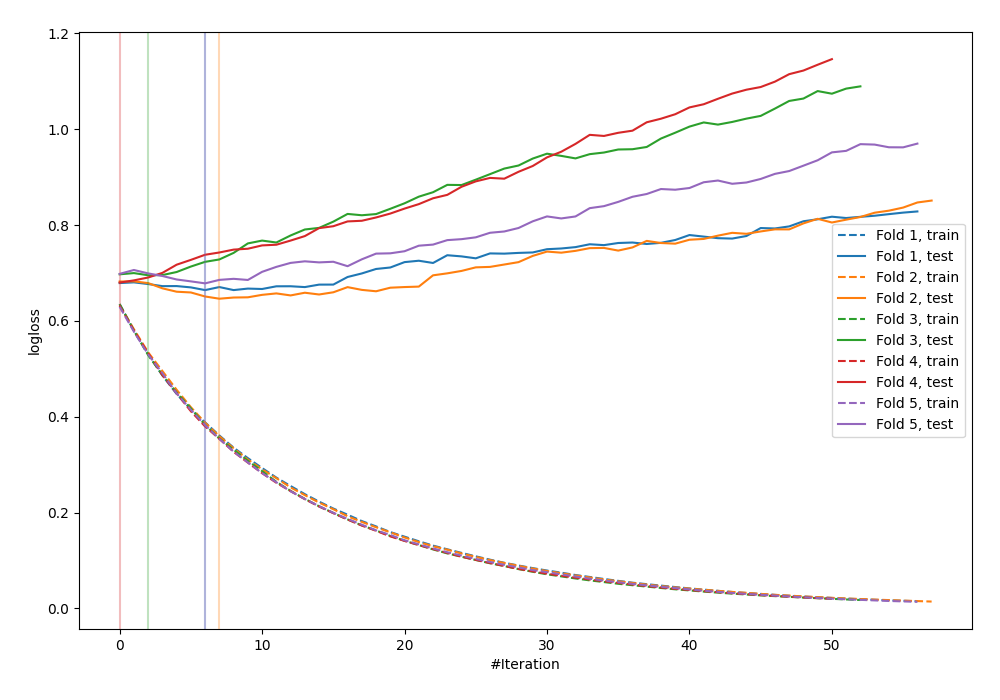

# Summary of 28_LightGBM

[<< Go back](../README.md)

## LightGBM
- **n_jobs**: -1
- **objective**: binary
- **metric**: binary_logloss
- **num_leaves**: 31
- **learning_rate**: 0.1
- **feature_fraction**: 0.8
- **bagging_fraction**: 0.8
- **min_data_in_leaf**: 5
- **explain_level**: 0

## Validation
 - **validation_type**: kfold
 - **shuffle**: True
 - **stratify**: True
 - **k_folds**: 5

## Optimized metric
logloss

## Training time

0.8 seconds

## Metric details
|           |    score |   threshold |
|:----------|---------:|------------:|
| logloss   | 0.672891 |  nan        |
| auc       | 0.611358 |  nan        |
| f1        | 0.666667 |    0.349598 |
| accuracy  | 0.603636 |    0.532262 |
| precision | 1        |    0.74719  |
| recall    | 1        |    0.182172 |
| mcc       | 0.210424 |    0.532262 |

## Confusion matrix (at threshold=0.532262)
|                     |   Predicted as negative |   Predicted as positive |
|:--------------------|------------------------:|------------------------:|
| Labeled as negative |                     107 |                      34 |
| Labeled as positive |                      75 |                      59 |

## Learning curves

[<< Go back](../README.md)
