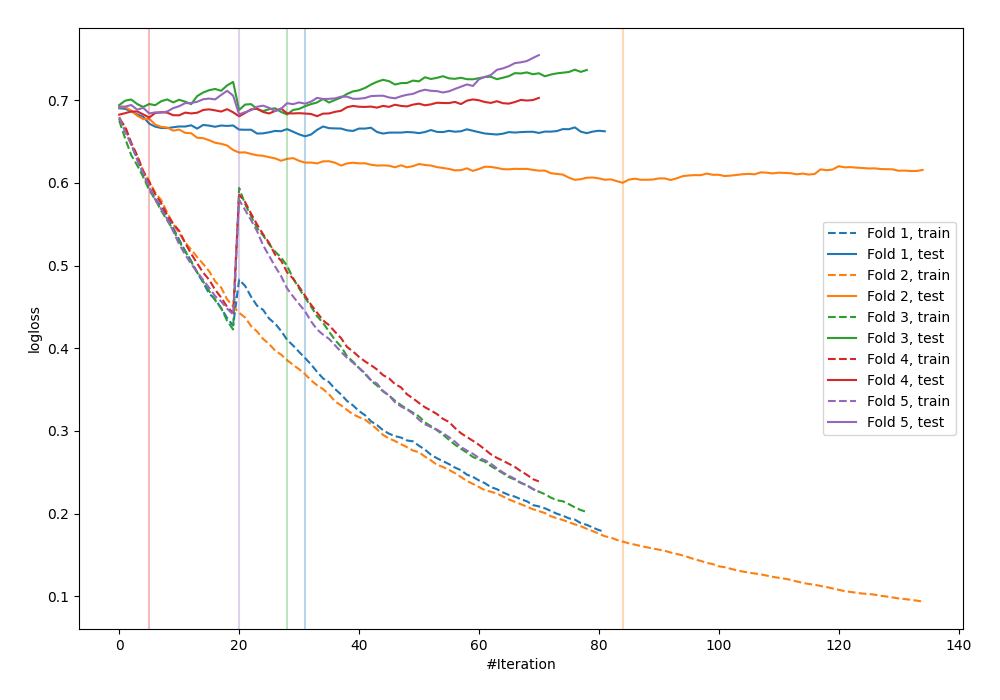

# Summary of 30_CatBoost

[<< Go back](../README.md)

## CatBoost
- **n_jobs**: -1
- **learning_rate**: 0.05
- **depth**: 8
- **rsm**: 0.8
- **loss_function**: Logloss
- **explain_level**: 0

## Validation
 - **validation_type**: kfold
 - **shuffle**: True
 - **stratify**: True
 - **k_folds**: 5

## Optimized metric
logloss

## Training time

4.0 seconds

## Metric details
|           |    score |   threshold |
|:----------|---------:|------------:|
| logloss   | 0.660505 | nan         |
| auc       | 0.644967 | nan         |
| f1        | 0.675462 |   0.375205  |
| accuracy  | 0.618182 |   0.488578  |
| precision | 0.833333 |   0.631685  |
| recall    | 1        |   0.0982478 |
| mcc       | 0.237649 |   0.488578  |

## Confusion matrix (at threshold=0.488578)
|                     |   Predicted as negative |   Predicted as positive |
|:--------------------|------------------------:|------------------------:|
| Labeled as negative |                      84 |                      57 |
| Labeled as positive |                      48 |                      86 |

## Learning curves

[<< Go back](../README.md)
