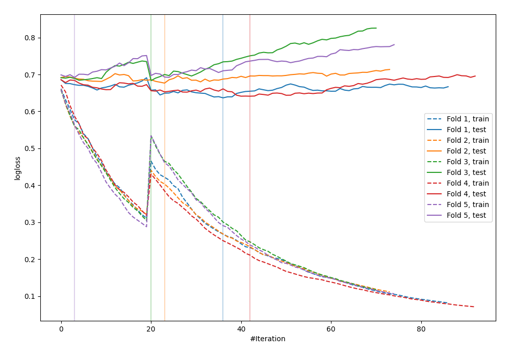

# Summary of 31_CatBoost_GoldenFeatures

[<< Go back](../README.md)

## CatBoost
- **n_jobs**: -1
- **learning_rate**: 0.1
- **depth**: 8
- **rsm**: 1.0
- **loss_function**: Logloss
- **explain_level**: 0

## Validation
 - **validation_type**: kfold
 - **shuffle**: True
 - **stratify**: True
 - **k_folds**: 5

## Optimized metric
logloss

## Training time

5.2 seconds

## Metric details
|           |    score |   threshold |
|:----------|---------:|------------:|
| logloss   | 0.666085 |  nan        |
| auc       | 0.63761  |  nan        |
| f1        | 0.658754 |    0.412363 |
| accuracy  | 0.618182 |    0.466617 |
| precision | 1        |    0.754729 |
| recall    | 1        |    0.123589 |
| mcc       | 0.244388 |    0.466617 |

## Confusion matrix (at threshold=0.466617)
|                     |   Predicted as negative |   Predicted as positive |
|:--------------------|------------------------:|------------------------:|
| Labeled as negative |                      75 |                      66 |
| Labeled as positive |                      39 |                      95 |

## Learning curves

[<< Go back](../README.md)
