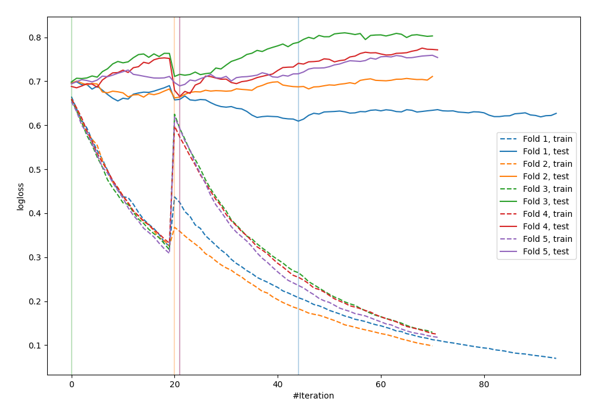

# Summary of 31_CatBoost_KMeansFeatures

[<< Go back](../README.md)

## CatBoost
- **n_jobs**: -1
- **learning_rate**: 0.1
- **depth**: 8
- **rsm**: 1.0
- **loss_function**: Logloss
- **explain_level**: 0

## Validation
 - **validation_type**: kfold
 - **shuffle**: True
 - **stratify**: True
 - **k_folds**: 5

## Optimized metric
logloss

## Training time

7.6 seconds

## Metric details
|           |    score |   threshold |
|:----------|---------:|------------:|
| logloss   | 0.667554 |  nan        |
| auc       | 0.619588 |  nan        |
| f1        | 0.672365 |    0.424948 |
| accuracy  | 0.6      |    0.480657 |
| precision | 1        |    0.735696 |
| recall    | 1        |    0.138527 |
| mcc       | 0.218936 |    0.439945 |

## Confusion matrix (at threshold=0.480657)
|                     |   Predicted as negative |   Predicted as positive |
|:--------------------|------------------------:|------------------------:|
| Labeled as negative |                      71 |                      70 |
| Labeled as positive |                      40 |                      94 |

## Learning curves

[<< Go back](../README.md)
