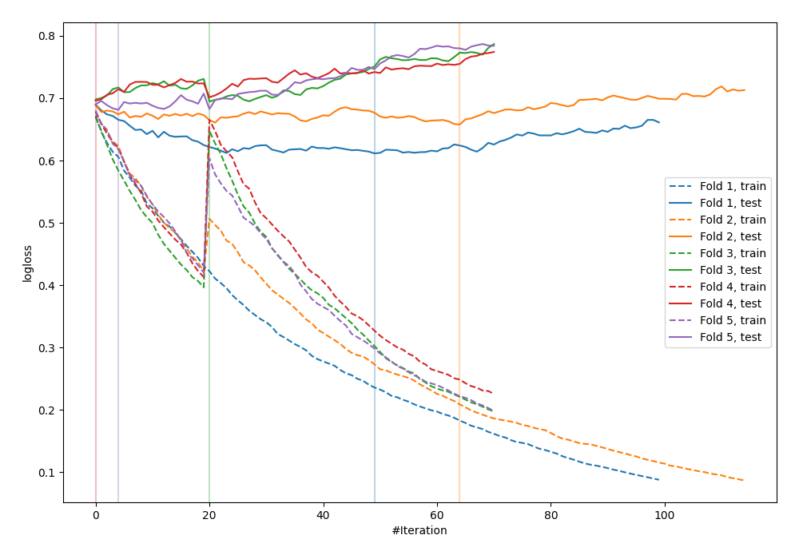

# Summary of 34_CatBoost

[<< Go back](../README.md)

## CatBoost
- **n_jobs**: -1
- **learning_rate**: 0.1
- **depth**: 6
- **rsm**: 0.7
- **loss_function**: Logloss
- **explain_level**: 0

## Validation
 - **validation_type**: kfold
 - **shuffle**: True
 - **stratify**: True
 - **k_folds**: 5

## Optimized metric
logloss

## Training time

1.8 seconds

## Metric details
|           |    score |   threshold |
|:----------|---------:|------------:|
| logloss   | 0.669612 | nan         |
| auc       | 0.590346 | nan         |
| f1        | 0.673575 |   0.342023  |
| accuracy  | 0.570909 |   0.454122  |
| precision | 0.9      |   0.776594  |
| recall    | 1        |   0.0973729 |
| mcc       | 0.189399 |   0.342023  |

## Confusion matrix (at threshold=0.454122)
|                     |   Predicted as negative |   Predicted as positive |
|:--------------------|------------------------:|------------------------:|
| Labeled as negative |                      49 |                      92 |
| Labeled as positive |                      26 |                     108 |

## Learning curves

[<< Go back](../README.md)
