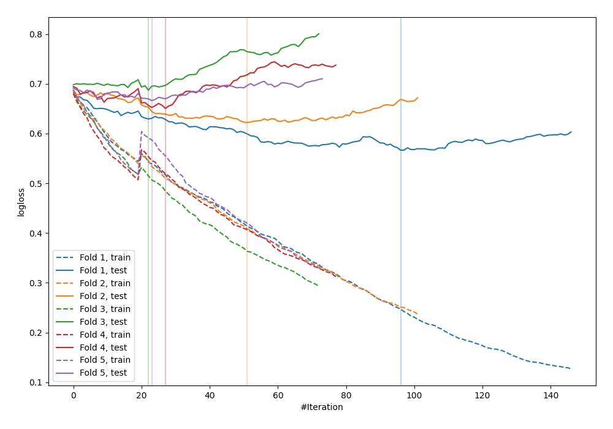

# Summary of 35_CatBoost

[<< Go back](../README.md)

## CatBoost
- **n_jobs**: -1
- **learning_rate**: 0.1
- **depth**: 4
- **rsm**: 0.7
- **loss_function**: Logloss
- **explain_level**: 0

## Validation
 - **validation_type**: kfold
 - **shuffle**: True
 - **stratify**: True
 - **k_folds**: 5

## Optimized metric
logloss

## Training time

1.6 seconds

## Metric details
|           |    score |   threshold |
|:----------|---------:|------------:|
| logloss   | 0.638605 |  nan        |
| auc       | 0.681645 |  nan        |
| f1        | 0.678899 |    0.422857 |
| accuracy  | 0.643636 |    0.502325 |
| precision | 1        |    0.735899 |
| recall    | 1        |    0.152224 |
| mcc       | 0.287876 |    0.470562 |

## Confusion matrix (at threshold=0.502325)
|                     |   Predicted as negative |   Predicted as positive |
|:--------------------|------------------------:|------------------------:|
| Labeled as negative |                      98 |                      43 |
| Labeled as positive |                      55 |                      79 |

## Learning curves

[<< Go back](../README.md)
