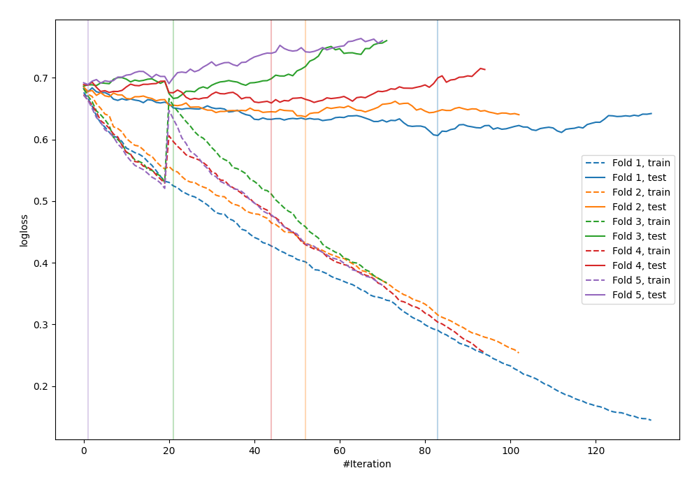

# Summary of 35_CatBoost_GoldenFeatures

[<< Go back](../README.md)

## CatBoost
- **n_jobs**: -1
- **learning_rate**: 0.1
- **depth**: 4
- **rsm**: 0.7
- **loss_function**: Logloss
- **explain_level**: 0

## Validation
 - **validation_type**: kfold
 - **shuffle**: True
 - **stratify**: True
 - **k_folds**: 5

## Optimized metric
logloss

## Training time

3.2 seconds

## Metric details
|           |    score |   threshold |
|:----------|---------:|------------:|
| logloss   | 0.651952 | nan         |
| auc       | 0.664444 | nan         |
| f1        | 0.666667 |   0.372712  |
| accuracy  | 0.647273 |   0.490185  |
| precision | 0.818182 |   0.751877  |
| recall    | 1        |   0.0884031 |
| mcc       | 0.300324 |   0.483757  |

## Confusion matrix (at threshold=0.490185)
|                     |   Predicted as negative |   Predicted as positive |
|:--------------------|------------------------:|------------------------:|
| Labeled as negative |                      86 |                      55 |
| Labeled as positive |                      42 |                      92 |

## Learning curves

[<< Go back](../README.md)
