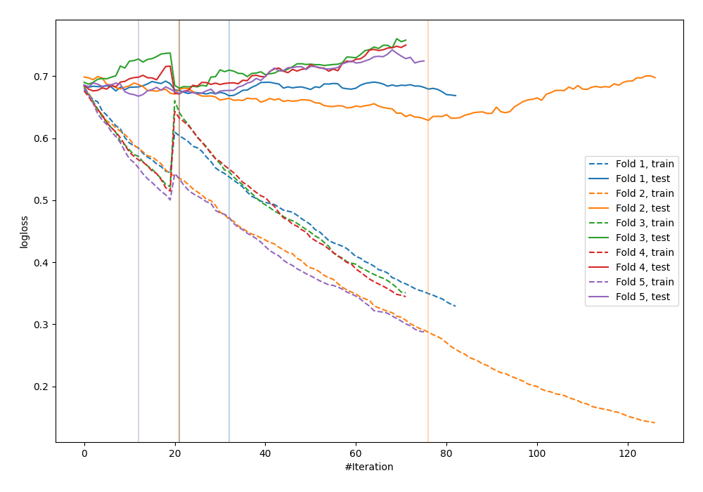

# Summary of 35_CatBoost_KMeansFeatures

[<< Go back](../README.md)

## CatBoost
- **n_jobs**: -1
- **learning_rate**: 0.1
- **depth**: 4
- **rsm**: 0.7
- **loss_function**: Logloss
- **explain_level**: 0

## Validation
 - **validation_type**: kfold
 - **shuffle**: True
 - **stratify**: True
 - **k_folds**: 5

## Optimized metric
logloss

## Training time

2.8 seconds

## Metric details
|           |    score |   threshold |
|:----------|---------:|------------:|
| logloss   | 0.664167 |  nan        |
| auc       | 0.640388 |  nan        |
| f1        | 0.658228 |    0.315516 |
| accuracy  | 0.629091 |    0.49809  |
| precision | 1        |    0.742289 |
| recall    | 1        |    0.13985  |
| mcc       | 0.257453 |    0.49541  |

## Confusion matrix (at threshold=0.49809)
|                     |   Predicted as negative |   Predicted as positive |
|:--------------------|------------------------:|------------------------:|
| Labeled as negative |                      95 |                      46 |
| Labeled as positive |                      56 |                      78 |

## Learning curves

[<< Go back](../README.md)
