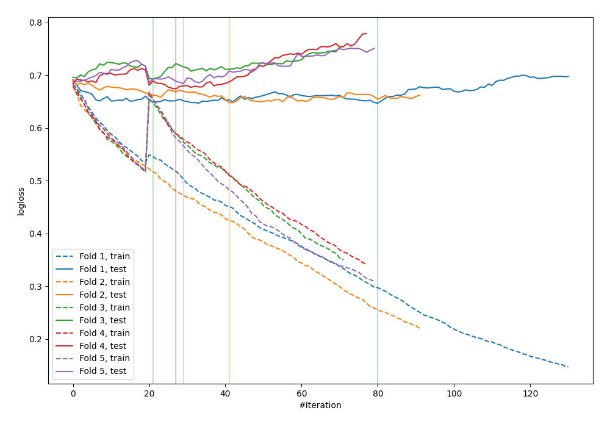
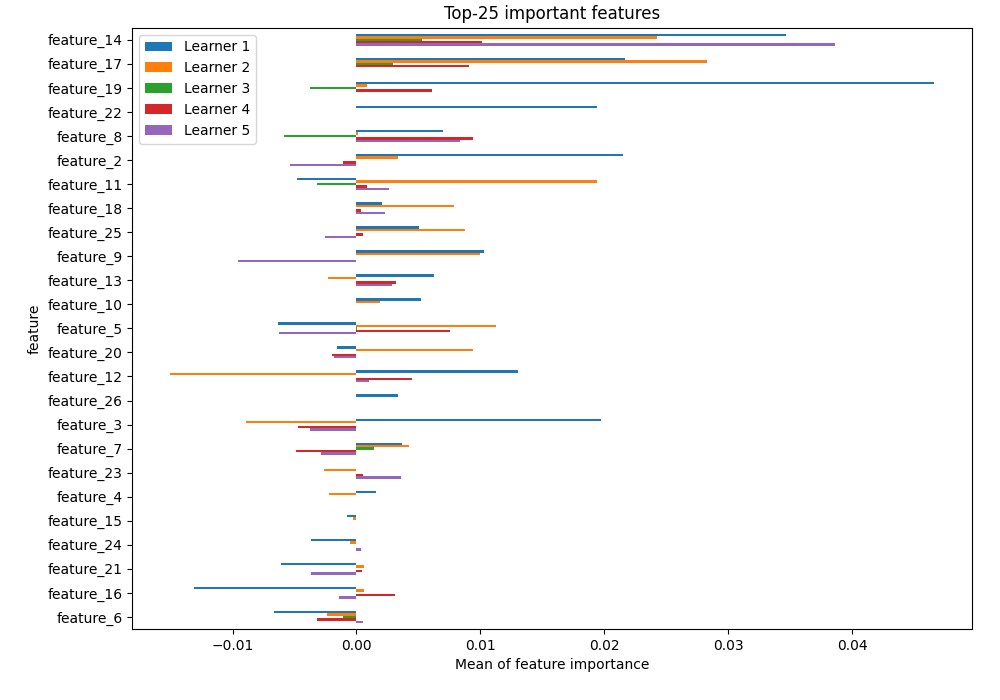

# Summary of 35_CatBoost_RandomFeature

[<< Go back](../README.md)

## CatBoost
- **n_jobs**: -1
- **learning_rate**: 0.1
- **depth**: 4
- **rsm**: 0.7
- **loss_function**: Logloss
- **explain_level**: 1

## Validation
 - **validation_type**: kfold
 - **shuffle**: True
 - **stratify**: True
 - **k_folds**: 5

## Optimized metric
logloss

## Training time

63.9 seconds

## Metric details
|           |    score |   threshold |
|:----------|---------:|------------:|
| logloss   | 0.668975 |  nan        |
| auc       | 0.621891 |  nan        |
| f1        | 0.661728 |    0.212181 |
| accuracy  | 0.596364 |    0.475254 |
| precision | 0.9      |    0.707991 |
| recall    | 1        |    0.107883 |
| mcc       | 0.197638 |    0.475254 |

## Confusion matrix (at threshold=0.475254)
|                     |   Predicted as negative |   Predicted as positive |
|:--------------------|------------------------:|------------------------:|
| Labeled as negative |                      75 |                      66 |
| Labeled as positive |                      45 |                      89 |

## Learning curves

## Permutation-based Importance

[<< Go back](../README.md)
