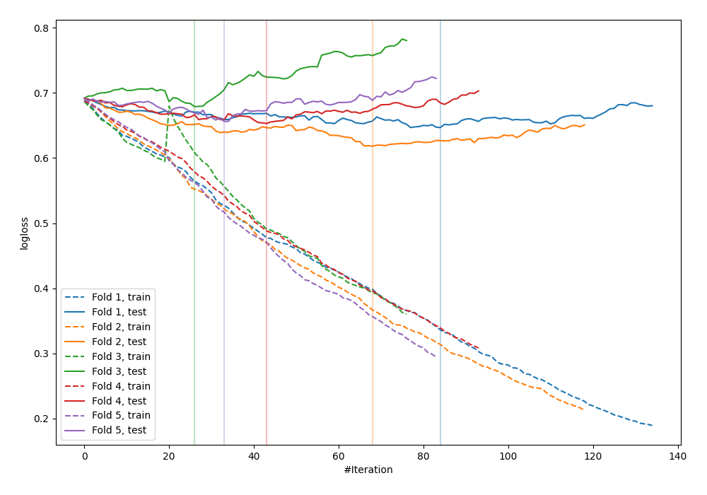

# Summary of 35_CatBoost_SelectedFeatures

[<< Go back](../README.md)

## CatBoost
- **n_jobs**: -1
- **learning_rate**: 0.1
- **depth**: 4
- **rsm**: 0.7
- **loss_function**: Logloss
- **explain_level**: 0

## Validation
 - **validation_type**: kfold
 - **shuffle**: True
 - **stratify**: True
 - **k_folds**: 5

## Optimized metric
logloss

## Training time

1.4 seconds

## Metric details
|           |    score |   threshold |
|:----------|---------:|------------:|
| logloss   | 0.650614 | nan         |
| auc       | 0.664391 | nan         |
| f1        | 0.672087 |   0.311867  |
| accuracy  | 0.643636 |   0.506499  |
| precision | 1        |   0.825718  |
| recall    | 1        |   0.0944416 |
| mcc       | 0.286811 |   0.49121   |

## Confusion matrix (at threshold=0.506499)
|                     |   Predicted as negative |   Predicted as positive |
|:--------------------|------------------------:|------------------------:|
| Labeled as negative |                      98 |                      43 |
| Labeled as positive |                      55 |                      79 |

## Learning curves

[<< Go back](../README.md)
