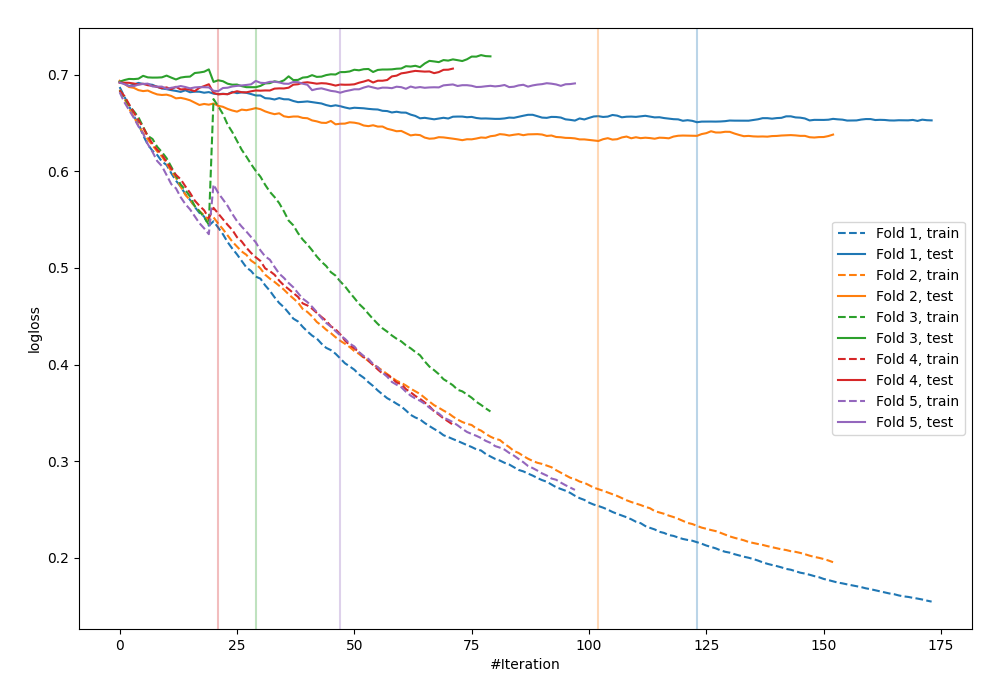

# Summary of 36_CatBoost

[<< Go back](../README.md)

## CatBoost
- **n_jobs**: -1
- **learning_rate**: 0.025
- **depth**: 8
- **rsm**: 1.0
- **loss_function**: Logloss
- **explain_level**: 0

## Validation
 - **validation_type**: kfold
 - **shuffle**: True
 - **stratify**: True
 - **k_folds**: 5

## Optimized metric
logloss

## Training time

5.9 seconds

## Metric details
|           |    score |   threshold |
|:----------|---------:|------------:|
| logloss   | 0.666067 |  nan        |
| auc       | 0.628771 |  nan        |
| f1        | 0.661111 |    0.415712 |
| accuracy  | 0.596364 |    0.496464 |
| precision | 0.857143 |    0.709307 |
| recall    | 1        |    0.230056 |
| mcc       | 0.229315 |    0.588498 |

## Confusion matrix (at threshold=0.496464)
|                     |   Predicted as negative |   Predicted as positive |
|:--------------------|------------------------:|------------------------:|
| Labeled as negative |                      81 |                      60 |
| Labeled as positive |                      51 |                      83 |

## Learning curves

[<< Go back](../README.md)
