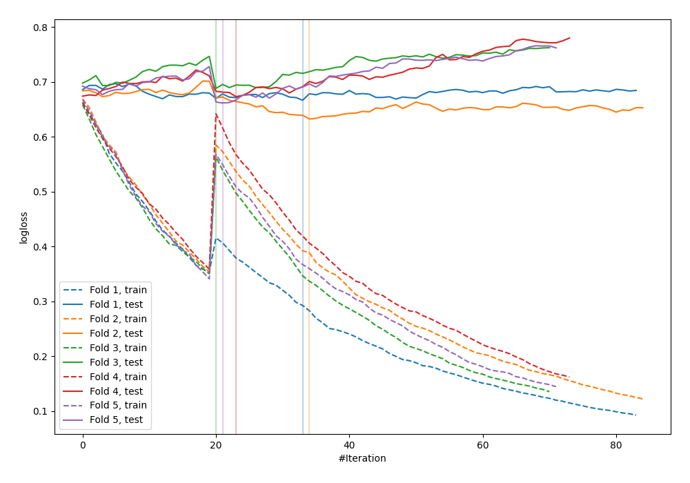

# Summary of 37_CatBoost

[<< Go back](../README.md)

## CatBoost
- **n_jobs**: -1
- **learning_rate**: 0.1
- **depth**: 7
- **rsm**: 0.8
- **loss_function**: Logloss
- **explain_level**: 0

## Validation
 - **validation_type**: kfold
 - **shuffle**: True
 - **stratify**: True
 - **k_folds**: 5

## Optimized metric
logloss

## Training time

2.4 seconds

## Metric details
|           |    score |   threshold |
|:----------|---------:|------------:|
| logloss   | 0.664356 |  nan        |
| auc       | 0.628242 |  nan        |
| f1        | 0.658354 |    0.266811 |
| accuracy  | 0.621818 |    0.531853 |
| precision | 1        |    0.760195 |
| recall    | 1        |    0.161799 |
| mcc       | 0.252563 |    0.535493 |

## Confusion matrix (at threshold=0.531853)
|                     |   Predicted as negative |   Predicted as positive |
|:--------------------|------------------------:|------------------------:|
| Labeled as negative |                     111 |                      30 |
| Labeled as positive |                      74 |                      60 |

## Learning curves

[<< Go back](../README.md)
