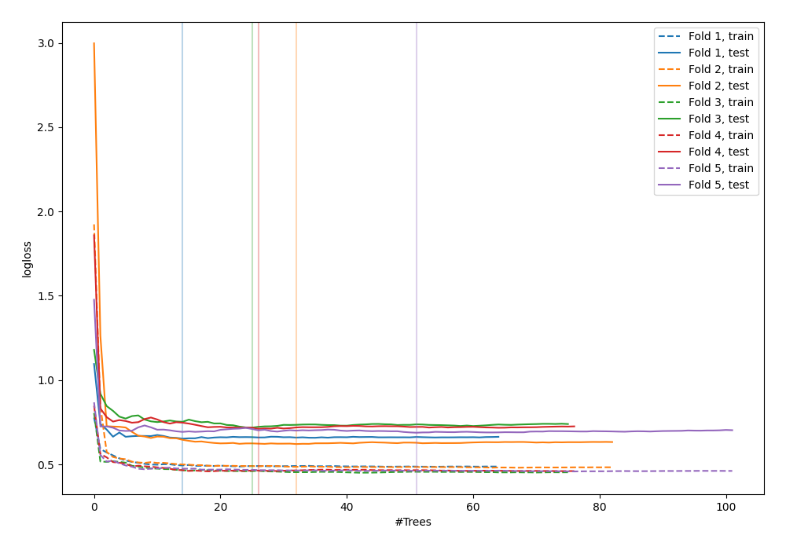

# Summary of 40_RandomForest

[<< Go back](../README.md)

## Random Forest
- **n_jobs**: -1
- **criterion**: gini
- **max_features**: 0.7
- **min_samples_split**: 30
- **max_depth**: 7
- **explain_level**: 0

## Validation
 - **validation_type**: kfold
 - **shuffle**: True
 - **stratify**: True
 - **k_folds**: 5

## Optimized metric
logloss

## Training time

3.6 seconds

## Metric details
|           |    score |   threshold |
|:----------|---------:|------------:|
| logloss   | 0.677999 |  nan        |
| auc       | 0.604689 |  nan        |
| f1        | 0.658354 |    0.217902 |
| accuracy  | 0.6      |    0.543017 |
| precision | 0.909091 |    0.720222 |
| recall    | 1        |    0.105819 |
| mcc       | 0.203816 |    0.547169 |

## Confusion matrix (at threshold=0.543017)
|                     |   Predicted as negative |   Predicted as positive |
|:--------------------|------------------------:|------------------------:|
| Labeled as negative |                     106 |                      35 |
| Labeled as positive |                      75 |                      59 |

## Learning curves

[<< Go back](../README.md)
