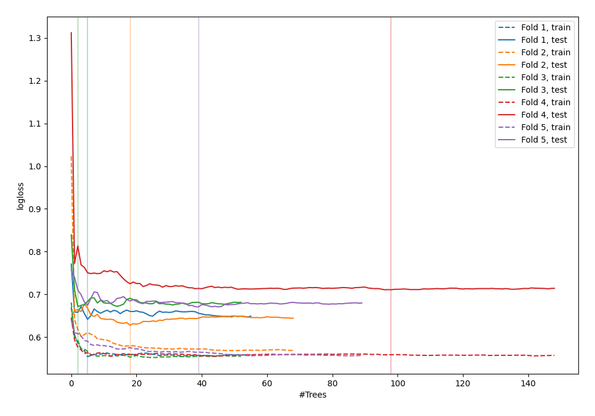

# Summary of 41_RandomForest

[<< Go back](../README.md)

## Random Forest
- **n_jobs**: -1
- **criterion**: gini
- **max_features**: 0.8
- **min_samples_split**: 40
- **max_depth**: 3
- **explain_level**: 0

## Validation
 - **validation_type**: kfold
 - **shuffle**: True
 - **stratify**: True
 - **k_folds**: 5

## Optimized metric
logloss

## Training time

3.6 seconds

## Metric details
|           |    score |   threshold |
|:----------|---------:|------------:|
| logloss   | 0.66418  |  nan        |
| auc       | 0.62983  |  nan        |
| f1        | 0.673797 |    0.312626 |
| accuracy  | 0.607273 |    0.573247 |
| precision | 0.88     |    0.662011 |
| recall    | 1        |    0.122406 |
| mcc       | 0.248463 |    0.662011 |

## Confusion matrix (at threshold=0.573247)
|                     |   Predicted as negative |   Predicted as positive |
|:--------------------|------------------------:|------------------------:|
| Labeled as negative |                     116 |                      25 |
| Labeled as positive |                      83 |                      51 |

## Learning curves

[<< Go back](../README.md)
