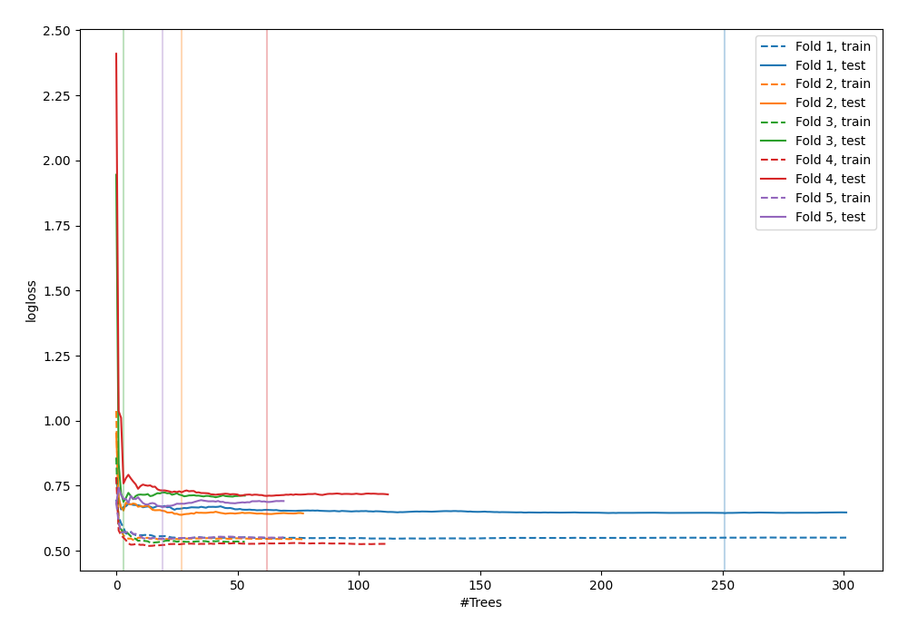

# Summary of 42_RandomForest

[<< Go back](../README.md)

## Random Forest
- **n_jobs**: -1
- **criterion**: entropy
- **max_features**: 0.6
- **min_samples_split**: 50
- **max_depth**: 6
- **explain_level**: 0

## Validation
 - **validation_type**: kfold
 - **shuffle**: True
 - **stratify**: True
 - **k_folds**: 5

## Optimized metric
logloss

## Training time

5.2 seconds

## Metric details
|           |    score |   threshold |
|:----------|---------:|------------:|
| logloss   | 0.670414 |  nan        |
| auc       | 0.632238 |  nan        |
| f1        | 0.666667 |    0.325941 |
| accuracy  | 0.607273 |    0.552519 |
| precision | 0.736842 |    0.639898 |
| recall    | 1        |    0.123369 |
| mcc       | 0.223339 |    0.554952 |

## Confusion matrix (at threshold=0.552519)
|                     |   Predicted as negative |   Predicted as positive |
|:--------------------|------------------------:|------------------------:|
| Labeled as negative |                     112 |                      29 |
| Labeled as positive |                      79 |                      55 |

## Learning curves

[<< Go back](../README.md)
