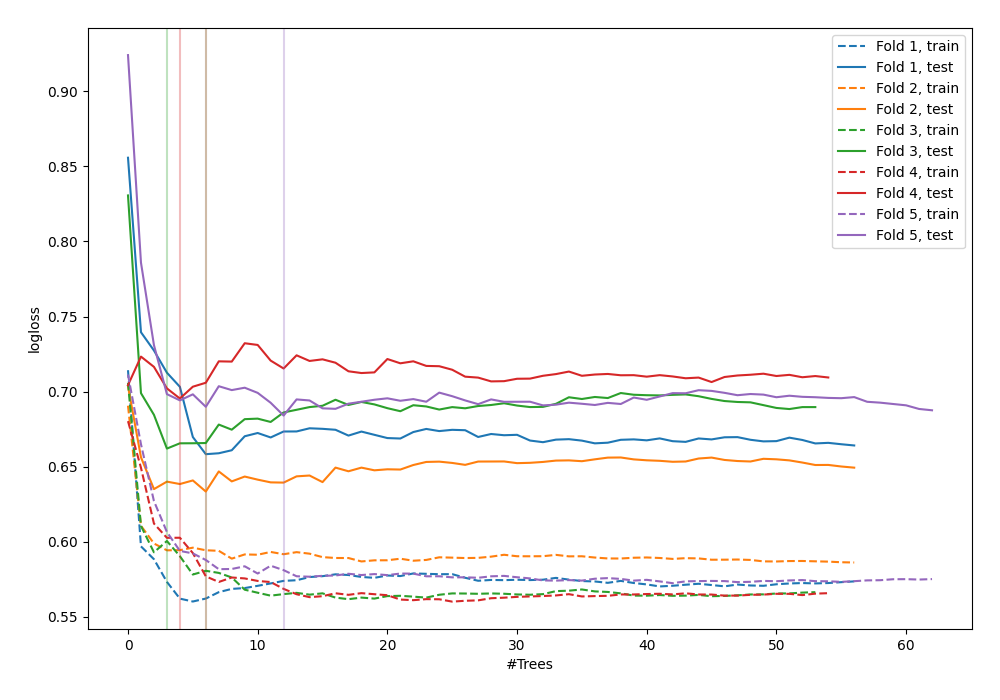

# Summary of 43_RandomForest

[<< Go back](../README.md)

## Random Forest
- **n_jobs**: -1
- **criterion**: gini
- **max_features**: 0.7
- **min_samples_split**: 50
- **max_depth**: 3
- **explain_level**: 0

## Validation
 - **validation_type**: kfold
 - **shuffle**: True
 - **stratify**: True
 - **k_folds**: 5

## Optimized metric
logloss

## Training time

2.8 seconds

## Metric details
|           |    score |   threshold |
|:----------|---------:|------------:|
| logloss   | 0.666582 |  nan        |
| auc       | 0.630465 |  nan        |
| f1        | 0.664935 |    0.29466  |
| accuracy  | 0.618182 |    0.541681 |
| precision | 1        |    0.76994  |
| recall    | 1        |    0.166764 |
| mcc       | 0.237654 |    0.541681 |

## Confusion matrix (at threshold=0.541681)
|                     |   Predicted as negative |   Predicted as positive |
|:--------------------|------------------------:|------------------------:|
| Labeled as negative |                     104 |                      37 |
| Labeled as positive |                      68 |                      66 |

## Learning curves

[<< Go back](../README.md)
