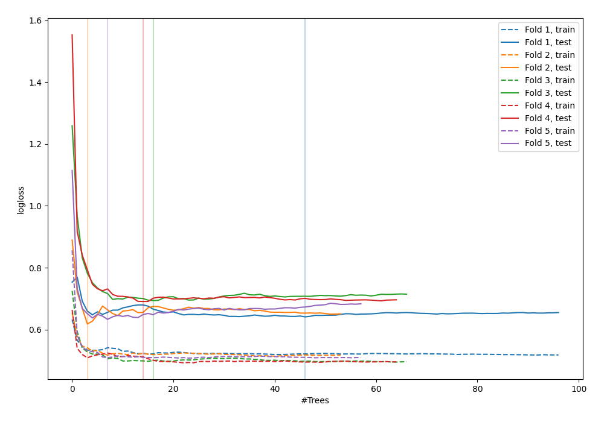

# Summary of 44_RandomForest

[<< Go back](../README.md)

## Random Forest
- **n_jobs**: -1
- **criterion**: gini
- **max_features**: 1.0
- **min_samples_split**: 40
- **max_depth**: 7
- **explain_level**: 0

## Validation
 - **validation_type**: kfold
 - **shuffle**: True
 - **stratify**: True
 - **k_folds**: 5

## Optimized metric
logloss

## Training time

3.1 seconds

## Metric details
|           |    score |   threshold |
|:----------|---------:|------------:|
| logloss   | 0.655349 |  nan        |
| auc       | 0.653514 |  nan        |
| f1        | 0.674286 |    0.357896 |
| accuracy  | 0.629091 |    0.476933 |
| precision | 0.842105 |    0.700226 |
| recall    | 1        |    0.120627 |
| mcc       | 0.260227 |    0.437095 |

## Confusion matrix (at threshold=0.476933)
|                     |   Predicted as negative |   Predicted as positive |
|:--------------------|------------------------:|------------------------:|
| Labeled as negative |                      87 |                      54 |
| Labeled as positive |                      48 |                      86 |

## Learning curves

[<< Go back](../README.md)
