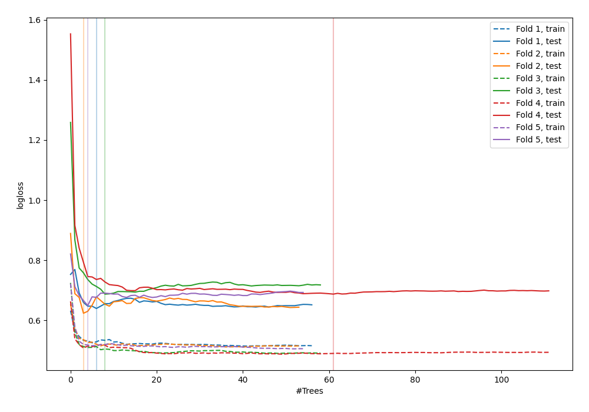

# Summary of 44_RandomForest_GoldenFeatures

[<< Go back](../README.md)

## Random Forest
- **n_jobs**: -1
- **criterion**: gini
- **max_features**: 1.0
- **min_samples_split**: 40
- **max_depth**: 7
- **explain_level**: 0

## Validation
 - **validation_type**: kfold
 - **shuffle**: True
 - **stratify**: True
 - **k_folds**: 5

## Optimized metric
logloss

## Training time

3.4 seconds

## Metric details
|           |    score |   threshold |
|:----------|---------:|------------:|
| logloss   | 0.657788 | nan         |
| auc       | 0.657325 | nan         |
| f1        | 0.668407 |   0.254123  |
| accuracy  | 0.64     |   0.490738  |
| precision | 1        |   0.852528  |
| recall    | 1        |   0.0939623 |
| mcc       | 0.278961 |   0.490738  |

## Confusion matrix (at threshold=0.490738)
|                     |   Predicted as negative |   Predicted as positive |
|:--------------------|------------------------:|------------------------:|
| Labeled as negative |                      97 |                      44 |
| Labeled as positive |                      55 |                      79 |

## Learning curves

[<< Go back](../README.md)
