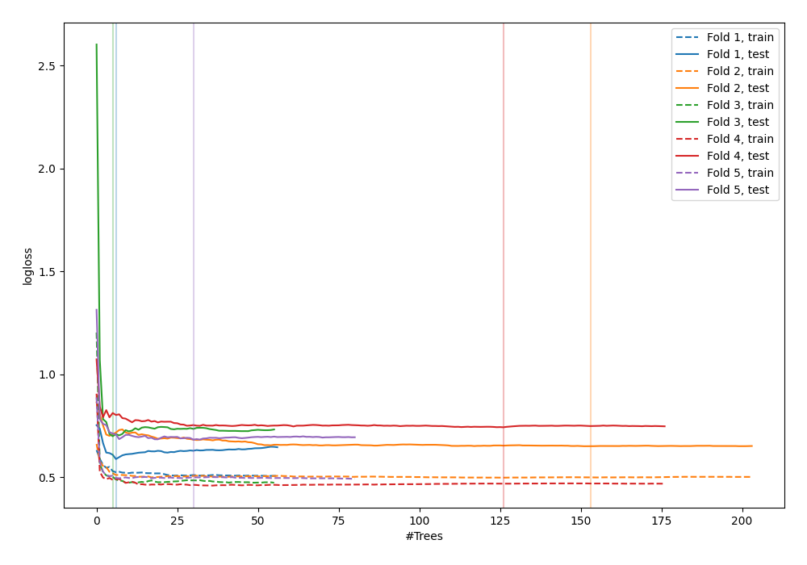

# Summary of 44_RandomForest_KMeansFeatures

[<< Go back](../README.md)

## Random Forest
- **n_jobs**: -1
- **criterion**: gini
- **max_features**: 1.0
- **min_samples_split**: 40
- **max_depth**: 7
- **explain_level**: 0

## Validation
 - **validation_type**: kfold
 - **shuffle**: True
 - **stratify**: True
 - **k_folds**: 5

## Optimized metric
logloss

## Training time

5.6 seconds

## Metric details
|           |    score |   threshold |
|:----------|---------:|------------:|
| logloss   | 0.673086 | nan         |
| auc       | 0.628242 | nan         |
| f1        | 0.661111 |   0.316787  |
| accuracy  | 0.614545 |   0.529067  |
| precision | 1        |   0.86959   |
| recall    | 1        |   0.0961458 |
| mcc       | 0.230977 |   0.529067  |

## Confusion matrix (at threshold=0.529067)
|                     |   Predicted as negative |   Predicted as positive |
|:--------------------|------------------------:|------------------------:|
| Labeled as negative |                     105 |                      36 |
| Labeled as positive |                      70 |                      64 |

## Learning curves

[<< Go back](../README.md)
