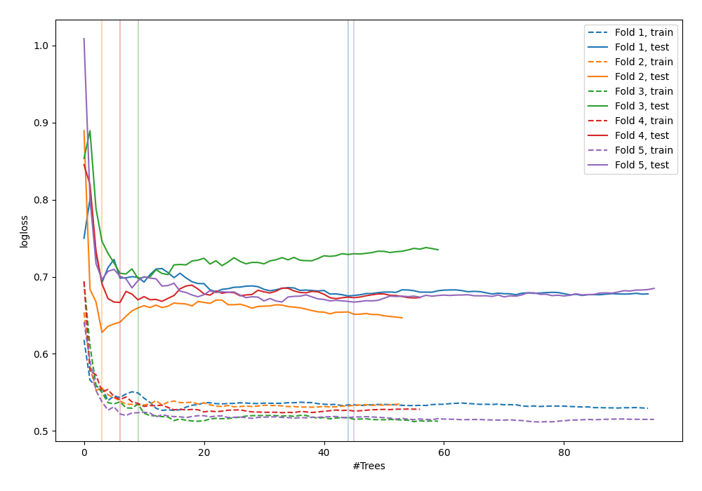

# Summary of 44_RandomForest_SelectedFeatures

[<< Go back](../README.md)

## Random Forest
- **n_jobs**: -1
- **criterion**: gini
- **max_features**: 1.0
- **min_samples_split**: 40
- **max_depth**: 7
- **explain_level**: 0

## Validation
 - **validation_type**: kfold
 - **shuffle**: True
 - **stratify**: True
 - **k_folds**: 5

## Optimized metric
logloss

## Training time

3.1 seconds

## Metric details
|           |    score |   threshold |
|:----------|---------:|------------:|
| logloss   | 0.666876 |  nan        |
| auc       | 0.648328 |  nan        |
| f1        | 0.674772 |    0.3973   |
| accuracy  | 0.629091 |    0.539341 |
| precision | 0.7      |    0.789807 |
| recall    | 1        |    0.131148 |
| mcc       | 0.258394 |    0.539341 |

## Confusion matrix (at threshold=0.539341)
|                     |   Predicted as negative |   Predicted as positive |
|:--------------------|------------------------:|------------------------:|
| Labeled as negative |                     102 |                      39 |
| Labeled as positive |                      63 |                      71 |

## Learning curves

[<< Go back](../README.md)
