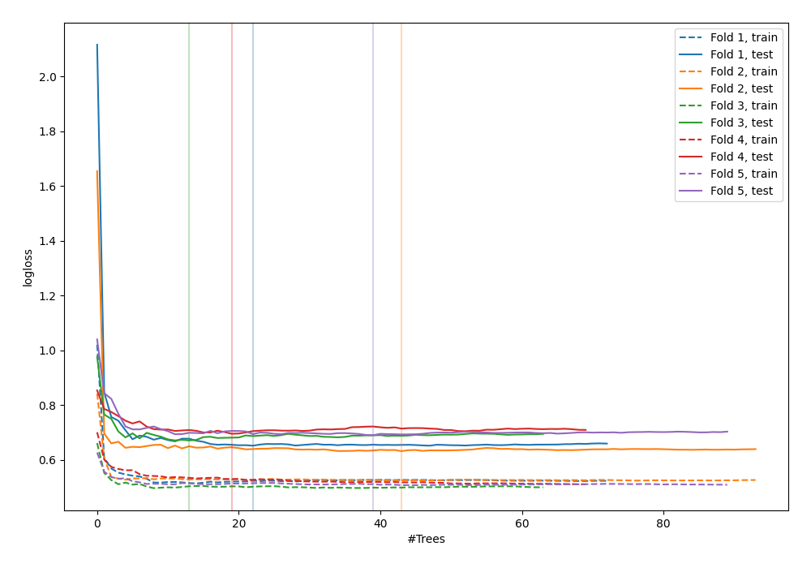

# Summary of 45_RandomForest

[<< Go back](../README.md)

## Random Forest
- **n_jobs**: -1
- **criterion**: gini
- **max_features**: 0.9
- **min_samples_split**: 40
- **max_depth**: 5
- **explain_level**: 0

## Validation
 - **validation_type**: kfold
 - **shuffle**: True
 - **stratify**: True
 - **k_folds**: 5

## Optimized metric
logloss

## Training time

3.4 seconds

## Metric details
|           |    score |   threshold |
|:----------|---------:|------------:|
| logloss   | 0.668144 |  nan        |
| auc       | 0.636975 |  nan        |
| f1        | 0.6703   |    0.332967 |
| accuracy  | 0.614545 |    0.425719 |
| precision | 0.84375  |    0.655568 |
| recall    | 1        |    0.122904 |
| mcc       | 0.258806 |    0.655568 |

## Confusion matrix (at threshold=0.425719)
|                     |   Predicted as negative |   Predicted as positive |
|:--------------------|------------------------:|------------------------:|
| Labeled as negative |                      68 |                      73 |
| Labeled as positive |                      33 |                     101 |

## Learning curves

[<< Go back](../README.md)
