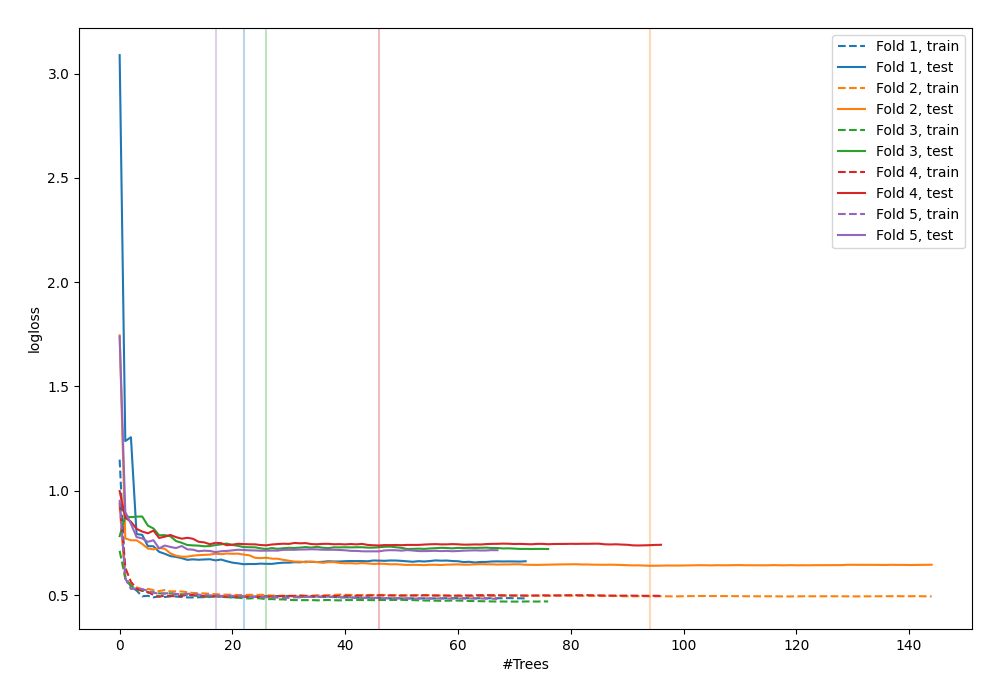

# Summary of 46_RandomForest

[<< Go back](../README.md)

## Random Forest
- **n_jobs**: -1
- **criterion**: gini
- **max_features**: 0.6
- **min_samples_split**: 20
- **max_depth**: 4
- **explain_level**: 0

## Validation
 - **validation_type**: kfold
 - **shuffle**: True
 - **stratify**: True
 - **k_folds**: 5

## Optimized metric
logloss

## Training time

4.0 seconds

## Metric details
|           |    score |   threshold |
|:----------|---------:|------------:|
| logloss   | 0.690428 |  nan        |
| auc       | 0.586218 |  nan        |
| f1        | 0.658291 |    0.251413 |
| accuracy  | 0.603636 |    0.506132 |
| precision | 0.75     |    0.719918 |
| recall    | 1        |    0.077728 |
| mcc       | 0.205785 |    0.509101 |

## Confusion matrix (at threshold=0.506132)
|                     |   Predicted as negative |   Predicted as positive |
|:--------------------|------------------------:|------------------------:|
| Labeled as negative |                      93 |                      48 |
| Labeled as positive |                      61 |                      73 |

## Learning curves

[<< Go back](../README.md)
